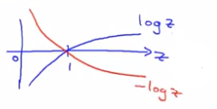
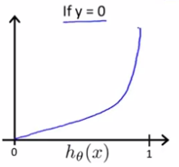
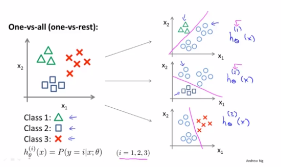

<!-- TOC -->

- [**Logistic回归**](#logistic%e5%9b%9e%e5%bd%92)
  - [**0.前言：为什么线性回归不适合做分类？**](#0%e5%89%8d%e8%a8%80%e4%b8%ba%e4%bb%80%e4%b9%88%e7%ba%bf%e6%80%a7%e5%9b%9e%e5%bd%92%e4%b8%8d%e9%80%82%e5%90%88%e5%81%9a%e5%88%86%e7%b1%bb)
  - [**1. 决策边界**](#1-%e5%86%b3%e7%ad%96%e8%be%b9%e7%95%8c)
  - [**2. 代价函数**](#2-%e4%bb%a3%e4%bb%b7%e5%87%bd%e6%95%b0)
  - [**3. 代价函数与梯度下降**](#3-%e4%bb%a3%e4%bb%b7%e5%87%bd%e6%95%b0%e4%b8%8e%e6%a2%af%e5%ba%a6%e4%b8%8b%e9%99%8d)
  - [**4. 高级优化**](#4-%e9%ab%98%e7%ba%a7%e4%bc%98%e5%8c%96)
  - [**5. 多元分类：一对多**](#5-%e5%a4%9a%e5%85%83%e5%88%86%e7%b1%bb%e4%b8%80%e5%af%b9%e5%a4%9a)

<!-- /TOC -->

## **Logistic回归**

以下例子都属于二元分类。即

$$ y \in {0,1} => \left\{
\begin{aligned}
0 : 负类型，如恶性肿瘤\\
1 : 正样类型，如良性肿瘤 \\
\end{aligned}
\right.
$$

在之后我们会谈到多分类问题，如$y \in {0,1,2,3...}$

### **0.前言：为什么线性回归不适合做分类？**

举个例子，肿瘤样本图形如下：

我们设计一个线性回归函数为 $h_\theta(x)=\theta^TX$。为了做分类决策，我们可以在线上选择一个点，其对应的$h_\theta(x)=0.5$，我们认定：

- 如果 $h_\theta(x) \geq 0.5$，我们预测“y=1”
- 如果 $h_\theta(x) \leq 0.5$，我们预测“y=0”

但是如果扩大x轴，我们增加一个样本点，则通过线性回归产生一个新的直线。此时我们也会有一个新的预测阈。但此时预测结果变差了。

因此通常在分类问题中使用线性回归的效果都不是good idea。此外在二元分类问题中我们希望的输出是0或者1，但是线性回归通常会>1或者<0，甚至差距很多。

因此在之后我们会讲logistics回归，它的特点在于算法的输出或者说预测值已知在0-1之间。虽然它的名字叫“回归”，但它妥妥的是分类算法。并且用于预测值$y$是离散的0或者1的情况。

在线性回归中，我们的定义$h_\theta (x)=\theta^Tx$，而在logistics回归中，我们定义$h_\theta (x)=g(\theta^Tx)$，而函数$g(z)=\frac{1}{1+e^{-z}}$被称为logistics函数或者说sigmoid函数。logistics回归的便来源于这个名字。

那么我们得到：$h_\theta(x) =\frac{1}{1+e^{-\theta^Tx}}$。他的图像：

sigmoid函数在正无穷趋近于1，负无穷趋近于0。并且在$x=0.5$的部分函数变得很陡。保证$h_\theta(x)$在(0,1)。

### **1. 决策边界**
对于图像

我们假设函数 $h_\theta(x)=g(\theta_0 + \theta_1x_1+\theta_2x_2)$
比方说我们另$\theta_0=-1 \quad \theta_1=1 \quad \theta_2=1$。即$\theta = [-3,1,1]$。

假设我们设置阈值$h_\theta \geq 0.5$时，我们预测$y=1$，则有$-3+x_1+x_2 \geq0 =>  x_1+x_2 \geq 3$

那么我们从上图可以看到，对于上式我们画一条经过(3,3)的直线。直线上方的将被预测为"1"，下方的将被预测为"0"。那么这一条直线（$x_1+x_2 = 3$），我们成为**决策边界**

决策边界是假设函数的一个属性，即参数$\theta$。即是我们把数据集从图片中删除，决策边界、区域y=0、区域y=1都是不变的。他们不是数据集的属性。我们用数据集确定参数$\theta$，但是当参数确定以后，我们将完全确定决策边界。

- 对应于非线性决策边界我们怎么处理呢？

    我们可以类似多项式回归/线性回归 给原函数添加额外的高阶多项式**特征缩放**。如：
    $h_\theta(x)=g(\theta_0 + \theta_1x_1+\theta_2x_2+\theta_3x_1^2+\theta_4x_2^2)$

    我们设$\theta = [-1,0,0,1,1]$。则有：预测“y=1” 则有"$-1+x_1^2+x_2^2 \geq 0$" ===> "$x_1^2+x_2^2 \geq 1$"
    
    如下图： 

    再一次强调，决策边界不是数据的属性！！！

### **2. 代价函数**
在线性回归中我们定义代价函数为：
> $J(\theta) = \frac{1}{m}\sum^m_{i=1} \frac{1}{2}(h_\theta(x^{(i)})-y^{(i)})^2$

我们把代价函数求和简略，定义$Cost(h_\theta(x),y) = \frac{1}{2}(h_\theta(x)-y)^2$

那么我们有一个大概的代价函数图像如左下图：

从左图可以由于$Cost(h_\theta(x),y)$中的$h_\theta(x)$是一个比较复杂的非线性函数。导致我们的代价函数是一个非凸的函数，我们在使用梯度下降很可能会陷入局部最优解。

因此我们希望能够获得一个如上面右图所示的凸函数的代价函数。因此我们定义代价函数如下：
>$Cost(h_\theta(x),y)= \left\{\begin{aligned}
-log(h_\theta(x)) : 当 y=1\\
-log(1-h_\theta(x)):当 y=0 \\
\end{aligned}
\right.$

当y=1时，我们有大概的代价函数图像如下:
 

我们知道$h_\theta \in (0,1)$，则该图像类似log函数在(0,1)的反数的图像

从图片中可以看出，当y=1时，$h_\theta(x)$越趋近于1，$Cost$的值越小；而$h_\theta(x)$越趋近于0，$Cost$的值趋近于无穷，我们将会利用这个大的Cost惩罚我们的参数。

而当y=0时，我们有代价函数$-log(1-h_\theta(x))$，图像表现为:

与y=1相反，当y=0时，$h_\theta(x)$越趋近于0，$Cost$的值越小；而$h_\theta(x)$越趋近于1，$Cost$的值趋近于无穷，我们将会利用这个大的Cost惩罚我们的参数。

### **3. 代价函数与梯度下降**
目前我们的代价函数为：
> $J(\theta) = \frac{1}{m}\sum^m_{i=1}Cost(h_\theta(x),y)$
> 
>$Cost(h_\theta(x),y)= \left\{\begin{aligned}
-log(h_\theta(x)) : 当 y=1\\
-log(1-h_\theta(x)):当 y=0 \\
\end{aligned}
\right.$
>注意对于这个代价函数：y=0 或 y=1总是成立

我们可以将上式简化合并为一个式子：
> $J(\theta)=Cost(h_\theta(x),y)=-ylog(h_\theta(x))-(1-y)log(1-h_\theta(x))$
> 
> 当y=1时，式子只剩下关于y=1的代价函数；y=0时同理。

利用梯度下降获得$min_\theta J(\theta)$:
(同时更新所有的$\theta_j$)
> Repeat{
>
> $\qquad \theta_j := \theta_j - \alpha\sum^m_{i=1}(h_\theta(x^{(i)}-y^{(i)})x^{(i)}_j)$
> 
> }

在线性回归部分我们学习了特征缩放，这同样也适用于logistic回归。

### **4. 高级优化**

我们在前面使用的优化Cost算法是**梯度下降**，但是这不是唯一的优化算法：
- 共轭梯度法
- BFGS
- L-BFGS

他们需要一种算法来算$J(\theta)$，另一种算法来算$\frac{\partial}{\partial\theta_j}J(\theta)$ 以及比梯度下降更复杂的算法来最小化代价函数。

选择这些算法的优点在于：
- 不需要手动选择学习率$\alpha$ （这些算法有一个智能内循环成为线搜索，它能自动尝试不同的学习率$\alpha$并自动选择一个好的学习率；甚至可以在不同迭代选择不同学习率）
- 通常比梯度下降更快
  
缺点：
- 算法更为复杂

### **5. 多元分类：一对多**
多分类问题在生活中很常见，如：
- 邮件分类问题：你有四种邮件，分别是工作、朋友、家庭和兴趣，y=[1,2,3,4]
- 药物诊断问题，根据病人的疾病分类：没病、感冒、流感，y=[1,2,3]
- 天气分类：大晴天、多云、雨天、下雪，y=[1,2,3,4]
  
下面是二分类与多分类示例图：
    

类比于二元分类的思想，我们把这三种类别的分类看成三个二元分类:
    

三个拟合分类器：$\quad h_\theta^{(i)}(x) = P(y=i|x;\text{}) \qquad (i=1,2,3)$

总结一下：
- 对每种分类$i$训练一个拟合分类器$\quad h_\theta^{(i)}(x)$来预测$y=i$的概率
- 对于一个新的输入$x$，我们把x带入三个你和分类器，选择最大概率的分类$max_ih_\theta^{(i)}(x)$作为预测结果

