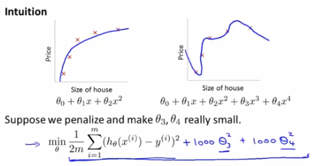
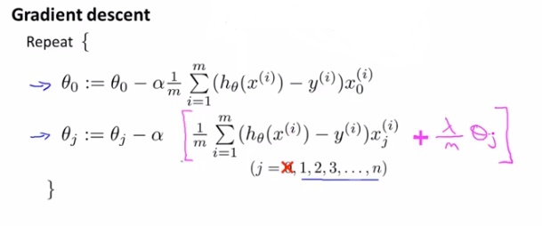
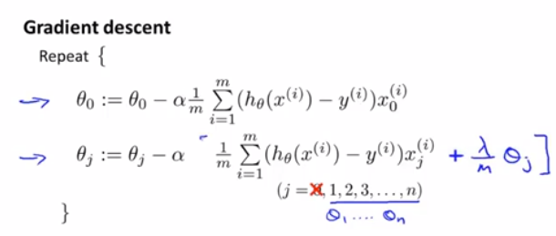

## **正则化**
- 过拟合问题：
    模型在训练集训练精度很高，但是在实际应用中性能不佳，模型泛化性差。
- 常用解决方法：
  - 减少特征数量（舍弃一些特征很可能导致重要特征被丢弃）
    - 手动减少
    - 通过算法选择
  - 正则化
    - 保持特征样本，但是减少模型参数的量级或者数量
    - 当我们有大量特征并且所有特征对预测结果y都有一点影响是，正则化的表现很好

### **1. 代价函数**
*这一部分我们将解释正则化是怎样运行的以及其相应的代价函数*

在下图中，我们假设左图是完美的拟合模型，右图很明显是一个过拟合的图像。

我们需要将$\theta_3,\theta_4$尽可能接近0，就相当于我们直接去掉了这两个参数。这样我们的拟合模型就会接近左图。
在这个例子中我们给参数设置了惩罚。

正则化的思想就是我们的模型参数较小，意味着一个较为简单更加平滑的的模型，它过拟合的风险就变小了。因此我们需要尽量简化我们的模型。

- 房价预测例子
  - 特征：$x_1,x_2,x_3,...,x_100$
  - 参数：$\theta_0,\theta_1,\theta_2,...,\theta_{100}$
    
    我们很难从这101个参数中找到对100个特征相关度高的。因此在正则化中我们对代价函数进行修改，使得它能缩小所有的参数：
    > $J(\theta) =\frac{1}{2m} [\sum^m_{i=1}(h(\theta(x^{(i)})-y^{i}))^2+\lambda \sum^{100}_{j=1}\theta^2_j] \qquad (一般我们不对\theta_0做正则化)$ 
    
    我们给代价函数最后添加了一个正则项。每一子项都会缩小对应的参数$\theta_j$

    在最终的式子中，$\lambda(正则化参数)$帮助我们权衡**预测误差（想要更高的精度）**和**正则项（想要降低过拟合）**这两个目标之前的取舍。$\lambda$取值过大会导致所有参数都接近于0，那么我们的模型就是一个直线/平面了，即导致我们模型偏差过高。

### **2. 线性回归的正则化**

> $J(\theta) =\frac{1}{2m} [\sum^m_{i=1}(h(\theta(x^{(i)})-y^{i}))^2+\lambda \sum^n_{j=1}\theta^2_j]$
> 
>$min_\theta J(\theta)$ 

- 对应的梯度下降为：

    我们可以把θ化为如下形式：
    > $\theta_j := \theta_j(1-\alpha \frac{\lambda}{m}) - \alpha \frac{1}{m}\sum^m_{i=1}( h_\theta(x^{(i)}) -y^{(i)} )x_j^{(i)}$

    > 式子$(1-\alpha \frac{\lambda}{m})$通常是一个比1小的数，因此每次都会把$\theta_j$缩小一点点

- 对应的正规方程为：

### **3. Logistic回归的正则化**
 
 代价函数：
 

 实现：
 
