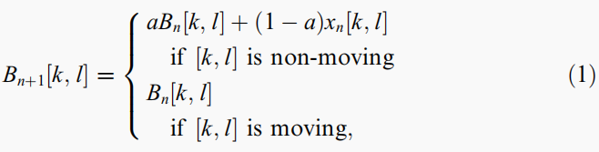
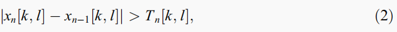
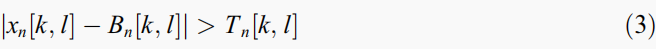
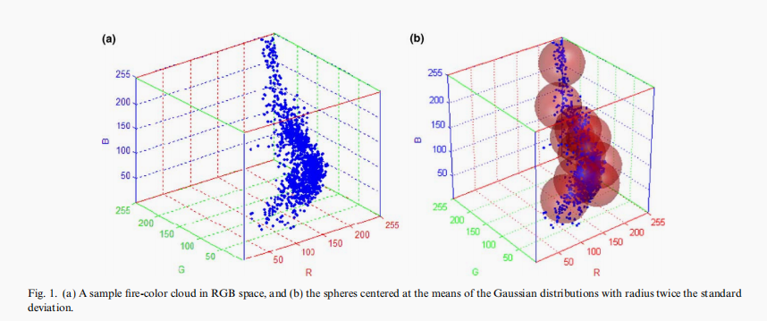
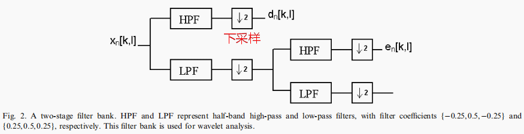
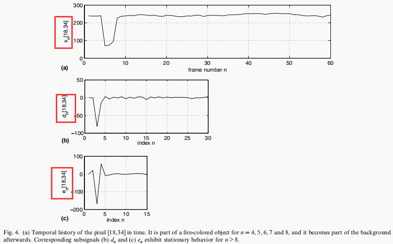
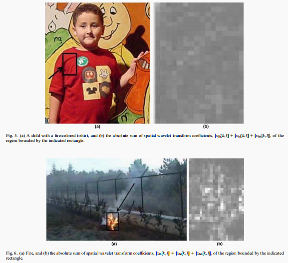
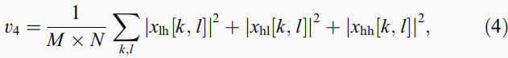

## **Computer vision based method for real-time fire and flame detection**

### **1. Moving region detection**
$x_n[k,l]$表示第n帧图中，位于$[k,l]$像素位置的 intensity (brightness) value亮度值。同一像素位置的估计背景强度值$B_{n+1}[k,l]$计算公式：

假设位于[k,l]处的像素在图像帧$x_n$和图像帧$x_{n-1}$中对应于其的亮度值满足以下不等式的情况下判定为移动：

当前景和背景差异极大的情况下，认为是移动。按照前景与背景之差来定义：

这部分结果为一个名为$Blobs[k,l]$的二进制像素map图，表明位于$[k,l]$的像素是否在移动。

### **2. Detection of fire-colored pixels**
将运动像素的颜色值与预定义颜色分布进行比较。

从包含火灾区域的样本图像中得到预定义火灾颜色分布，可能的颜色值在RGB颜色空间中形成一个三维点云，如图a。通过在RGB颜色空间中使用Gaussian的混合物来表示云，根据过去的观测结果，建立了一个具有10个高斯分布的高斯混合模型。如图b。

设$x[k,l]$为位置$[k,l]$的像素，具有颜色值$[r[k,l],g[k,l],b[k,l]]$。我们检查像素是否位于Gaussian中心的两个标准偏差内，以确定其性质。

给定像素颜色值在图b所示的一个球内，则假定它是火焰像素。

我们设置了一个名为$fire_colored$的二进制掩码，它返回给定的像素是否为火颜色。

将该掩模与在第一步骤中形成的$Blocks$的交点作为一个新的二进制mask输到下一步骤中，并称该新掩码为$fire$。

### **3. Temporal wavelet analysis**

第三步是跟踪火灾区域像素的历史频率，并对其历史进行分析。

将上一步的mask的每一个像素$x_n[k,l]$输入下面的两级滤波器组：

（下采样每次图像大小减半）

滤波组由半道高通和半道高通过滤器组成，他们的过滤因子分别为：
{-0.25,0.5,-0.25}和{0.25,0.5,0.25}

时间小波分析可以使用YUV颜色表示中的亮度(Y分量)或RGB颜色表示中的红色分量进行。在论文中使用了红通道。

在静止像素中，由于子带分析中使用的高通滤波器，这两个子信号的值应当等于零或非常接近零。

上图只在前面极少帧出现了变化，之后都平稳接近0，因此判断为背景。

### **4. Spatial wavelet analysis**
第四个步骤是包含火灾掩模像素的运动区域的空间小波分析，以捕捉像素值中的颜色变化。在普通的火色中物体在移动区域中会有很小的空间变化（Fig.5），而火焰区域将有显著的空间变化（Fig.6）。

将低高、高底，高高波 子图像的绝对值相加。根据小波子图像的能量定义此步骤的决策参数v4：

如果v4超过了阈值，那么这个被调查的移动和火色区域很可能是一个火灾区域。

### **5. Decision fusion**

使用$T-out-of-v$投票制度。当满足$H = \sum_i w_iv_i > T$，其中$w_i$是人为定义的权重，可以为0或者1，$T$为人为定义阈值。$v_i$对于前面四个判断。
- 如果像素是运动像素，则$v_1$是1，并且如果它是静止的则是0。
- 作出决策参数$v_2$,如果像素是火焰色的，则为1，否则为0。
- 如果在几秒内$e_n[K,L]$和/或$d_n[K,L]$的过零点的数目超过阈值,则判定参数$v_3$为1,否则为0。 
- 在公式4中定义了决策参数v4

在不受控制的火灾中，预计火灾区域应具有非凸边界。为了获得对虚警的进一步鲁棒性，另一个检查火灾区域凸性的步骤被添加到所提出的算法中。
- 用启发式方法验证了区域的凸性。
- 用$5 \times 5$的网格沿等距的五条垂直线和五条水平线检查$fire$区域的边界的凸性
- 判断每个pixel是否属于这个被调查区域。如果有至少三个联系的pixels属于背景，那么这个则该区域违反了凸性条件。
- 在相交的垂直 和/或 水平线上具有背景像素，则认为$fire$ mask区域具有非凸边界。
- 这消除了由于光源（如太阳）导致的假警报