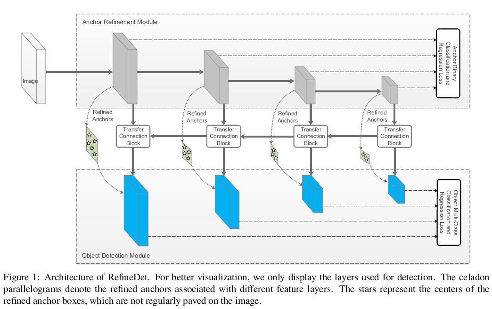
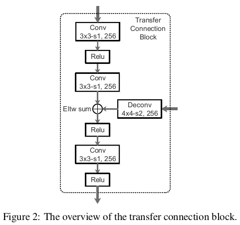

- [论文阅读 | RefineDet,CVPR,2018](https://www.cnblogs.com/cieusy/p/10302025.html)
- [代码](https://github.com/sfzhang15/RefineDet)

# **RefineDet：Single-Shot Refinement Neural Network for Object Detection**

ARM类似于Faster R-CNN的RPN，用于去除negative anchors并粗略调整anchors的位置和尺寸；

ODM类似于SSD结构，对refined anchors进行进一步回归和分类。这两个互连模块（其实算是两个SSD）模拟了两级结构。

此外，文中还设计了transfer connection block（TCB）来进行特征转换，也就是将ARM输出的feature map转换成ODM的输入。

TCB通过在传输的特征中添加高层特征来集成大尺度的context，采用反卷积放大高层feature map然后进行element-wise sum，并在求和后加入一个卷积层，以保证特征的可识别性。

得益于TCB的特征融合，使得ODM低层的feature map融合了高层的feature map的语义信息，并基于每层的feature map进行预测，最后对各层的预测结果进行综合，相比于SSD，该部分的优势在于**融合了多个层次的feature map**，可以有效提升对小目标的检测效果。