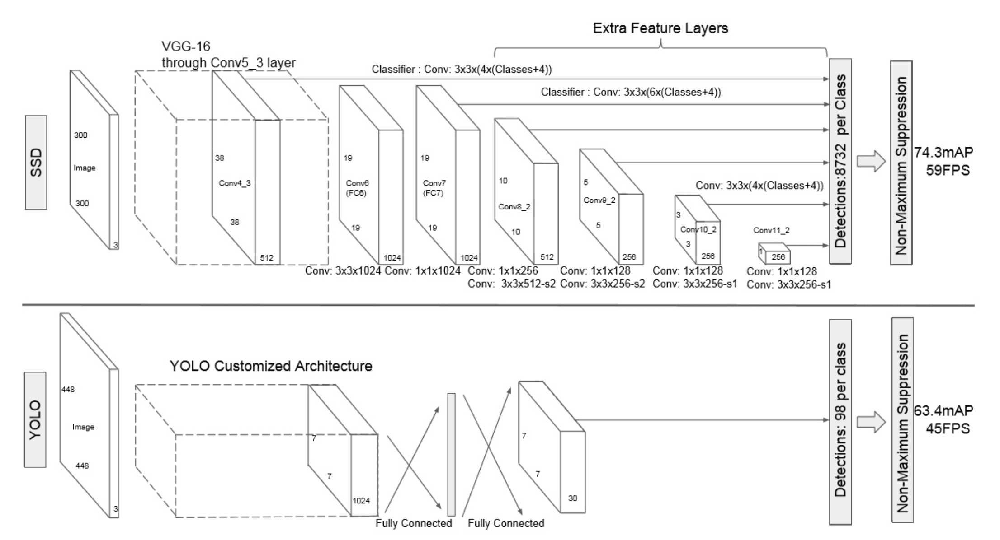

## **RCNN & SSD & YOLO**

## **SSD & YOLO**

1. **SSD 多尺寸feature map上进行目标检测**

    就是特征金字塔检测方式。从不同尺度的特征图下面来预测目标分类与位置。

    可以克服yolo对于宽高比不常见的物体，识别准确率较低的问题。

    而yolo中，**只在最后一个卷积层上做目标位置和类别的训练和预测。这是SSD相对于yolo能提高准确率的一个关键所在。**

2. **SSD多个anchors，每个anchor对应4个位置参数和21个类别参数**
    
    和faster R-CNN相似，SSD也提出了anchor的概念。

    卷积输出的feature map，每个点对应为原图的一个区域的中心点。以这个点为中心，构造出6个宽高比例不同，大小不同的anchor（SSD中称为default box）。每个anchor对应4个位置参数(x,y,w,h)和21个类别概率（voc训练集为20分类问题，在加上anchor是否为背景，共21分类）。

3. **筛选层**
    
    和yolo的筛选层基本一致，同样先过滤掉类别概率低于阈值的default box，再采用NMS非极大值抑制，筛掉重叠度较高的。只不过SSD综合了各个不同feature map上的目标检测输出的default box。

[参考博客](https://blog.csdn.net/zhangyuexiang123/article/details/99828692)