# **1 基于深度学习的两阶段目标检测方法**

两阶段目标检测方法，就是将目标检测过程分为两个阶段：
1. 首先在目标图像上生成多个区域预选框
2. 然后对预选框内的目标区域进行分类以及回归，从而得到最终的检测结果。

这一类目标检测方法包括经典区域卷积网络RCNN系列（RCNN，Fast RCNN、Faster RCNN）以及相关变体，例如基于特征金字塔网络（Feature Pramid Network）、Mask RCNN、带有高阶统计信息（Multi-scale Loaction-aware Kernerl Representation，MLKP）的Faster RCNN。

目标检测不但要识别出目标类别，还要准确描绘出目标边界。

## **1.1 R-CNN**
### **1.1.1 算法引言**
RCNN不需要手工设计特征，它通过在图像生成若干个候选区域，并对每个候选区域利用深层卷积神经网络学习其特征表达。然后训练支持向量机SVM对候选区域进行分类和筛选，得分最高的候选区域即为最终的检测目标。

- RCNN用小样本对深层卷积网络进行参数微调，进一步提升检测算法的性能。
- 利用【非极大值抑制】和【坐标回归】等策略提高算法准确度
  
### **1.1.2 基础原理**

RCNN总共分为三个模块：

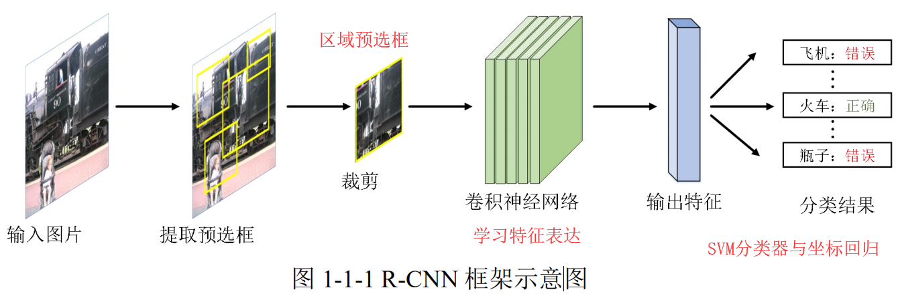

- 区域预选框生成
    
    Selective Searsh在图中生成2000个左右区域预选框，而这些预选框基本上涵盖了图像中所有物体。

    接下来判断这些区域预选框是前景还是背景。

    选择性搜索之前，区域预选框是基于滑窗的。使用不同尺寸的矩形框一行一行地扫描整张图像，通过提取矩形框内的特征，判断是否有待检测的物体。时间复杂度高，效率慢。Selective Search的改进：
    - 传统方法需要使用不同尺寸的矩形框检测物体，防止遗漏。选择性搜索方法采用了一种具备层次结构的方法解决这个问题。
    - 选择性搜索的方法将产生预选框和检测两个过程解耦，首先快速的产生可能是 物体的区域，然后在进行具体的检测。
    - 选择性搜索的方法使用多种先验知识来对各个区域进行简单的判别，避免一些无用的搜索，提高速度和精度

    选择性搜索的主要步骤：
    - 使用图分割方法将图像初始化为很多区域集合$R$。初始化一个相似度集合$S$，且$S$为空集【初始区域】
    - 计算集合$R$中所有相邻区域的相似度，并将结果放入到集合 $S$中，集合$S$保存的是一个区域对以及他们之间的相似度【计算相似度】
    - 找出集合$S$中相似度最高的区域对，并将对应区域合并。从$S$中删除与它们相关的所有相似度和区域对。步骤重复这两步，直到$S$为空。【合并最相似区域、删除其他相似区域】
    - 从$R$中找出所有包围区域的最小矩形框，这些矩形框就是物体可能的区域。为了提高速度，新合并区域的特征可以通过之前两个区域获得，而不必重新遍历新区域的像素点进行计算。【得到结果】

    计算两个区域的相似度是选择性搜索方法的关键步骤，作者提出了一种互补相似度测量的方法，使用**颜色，纹理，尺寸和交叠四个指标来度量两个独立区域的相似程度**。 最后，提取由选择性搜索方法得到的区域的**SIFT特征（尺度不变特征变换（Scale-invariant feature transform，SIFT））**，使用 SVM 分类器对区域进行 分类，得到最终的检测结果

- 特征表达学习
    - 通过直接将区域预选框内的内容拉伸为固定尺寸（227 × 227）输入网络
    - 下面是RCNN使用的特征表达学习框架：
        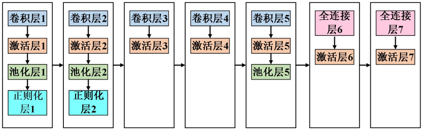
- 区域预选框分类及回归
  - 一对多的多分类SVM分类器
  - 难样本挖掘的策略
  - 训练好的SVM分类器可以对每个区域预选框进行判别分类（前景、后景）
  - 回归的方法：将预选框和真实边界框坐标进行回归
  - 给定一组输入特征向量，通过学习一组参数，使得经过线性回归后的结果尽量接近真值
    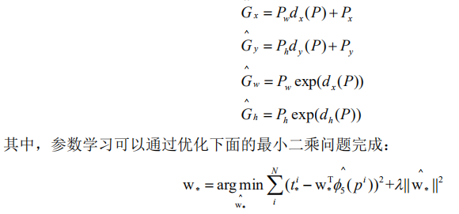

    表示从深层卷积神经网络最后一个池化层得到的特征表达。最终的回归目标为：

    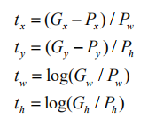

上面分别介绍了 R-CNN 的三个重要组成部分，其整体流程图如图:
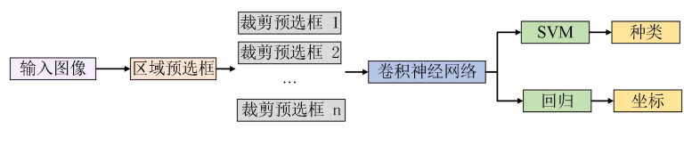

- RCNN的训练阶段：
  - 基于监督信息的模型预训练
      
      ImageNet 数据 集只包括图像的类别标签 (即监督信息)，而没有真实边界框坐标信息，所以这部分训练只针对于分类任务，而不包括回归任务
  - 特定任务上的参数微调
      
      在第二阶段 训练过程中使用较小学习率 (例如 0.001)的随机梯度下降 (Stochastic Gridient Decend, SGD)在特定数据集上继续调整网络参数。

      - IOU > 0.5，则选为正样本
      - IOU < 0.5，则选为负样本

  - 训练特定类别的分类器

      每类训练一个线性 SVM 分类器用于判断预选框内的内容。
      - 为了构造训练SVM所需的正负样本，同样使用交叠比的方法对训练样本进行选择
      - 大于阈值则为正样本，小于阈值为负样本，一般阈值的值为0.3。
- RCNN的测试阶段：
  - selective search生成若干个区域预选框
  - 区域预选框尺度调整
  - 输入网络进行特征表达
  - SVM对每个预选框的特征表达进行评分——>使用贪心非极大值就散每个预选框面积，根据得分排序——>得分最高的作为输出结果——>计算其余预选框与最高分的交叠比——>去除小于阈值的预选框——>重复，直到预选框为空
  - 将得分小于一定阈值的预选框删除，得到最终结果

---

## **1.2 Fast RCNN**
2015年
### **1.2.1 算法引言**
1. 问题：
   - 对具有重叠的区域预选框依次进行特征表达，不断从存储磁盘中读写。
   - 训练速度慢。RCNN分为三个独立阶段，特别是在最后一个阶段，需 要把预先提取的特征表达存储在硬盘上，然后训练 SVM。
2. 改进：提出RoI-Pooling的网络模块和一系列优化训练策略
    
    - 特征表达直接对整个图像一次性完成
    - 利用 RoI-Pooling 代替预选区域的尺寸变换，保持了原有预选区域的比例，避免了图像变形失真带来的精度损失。
    - 将分类和回归设计到一个统一的框架内进行联合训练，相比原来的分离训练策略，既提高了训练效率又提高了预测精度，采用多任务的方法训练整个网络。
3. 过程：图像送入深度卷积网络 ——> 对特征图根据预选框进行RoI-Pooling ——> 一次性提取所有预选区域特征表达 

### **1.2.2 基础原理**

1. 特征提取层： 
   
   不同尺寸图像整体输入深层卷积网络的卷积层，特征提取所用网络结构：
   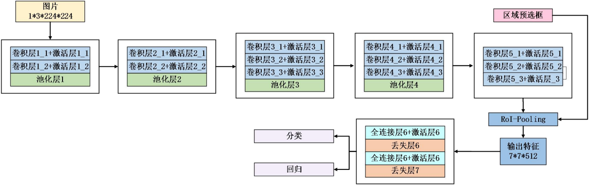
2. RoI-Pooling层。作用是为所有不同大小的区域预选框在特征图上一次性生成固定维度的特征表达。
   
   将 一 个h × w的 区 域 预 选 框 分 割 成 H × W ( 以 VGG-VD16网络架构为例，H=W=7)大小的网格，然后将这个区域预选框映射到提 取的特征图上，每个网格大小为 ݄h/H × w/W，最后计算每个网格里的最大值作为该网 格的输出，分别对每个特征通道进行单独计算。
3. 预选区分类。
4. 回归。损失函数使用smooth-L1

---

## **1.3 Faster RCNN**
### **1.3.1 算法引言**
2015年

1. 提出了**区域预选框网络 (Region Proposal Network，RPN**）代替了传统的选择性搜索策略
2. 将目标检测的四个基本步骤 (**预选框生成，特征提取，分类及回归**)统一到一个 网络结构中，**真正地实现了端到端的目标检测框架**。

### **1.3.2 基础原理**

1. 区域预选网络。
   
   RPN 网络由卷积层构成， 对于任意输入图像，其为**每一个特征点生成 9 个锚点框**。
   
   如果锚点框满足：(1)与标签框的交叠比最高；(2)与任意一个标签 框的交叠比大于 0.7，则认为该锚点框内是一个前景物体，被标注为正样本。

   如果锚点框与所有的标签框的交叠比都小于0.3，则认为该锚点框内的内容是背景，被标注为负样本。

   RPN 网络包含两个损失函数，其中二分类 SofMax 损失函数用于判断预选框是前景还是背景。另一个损失函数为回归损失，函数定义与 Fast R-CNN 中 SmoothL1 损失相同。

2. 训练方式：端到端训练 / 四步迭代
    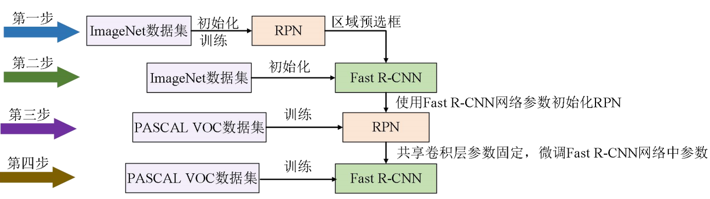
    - 训练RPN，使用ImageNet初始化，参数微调
    - RPN生成的预选框作为输入，训练Fast RCNN检测网络，此时**未共享卷积层**
    - 用检测网络初始化 RPN 进行训练，令两个网络卷积层共享并**固定共享卷积层参数，只对 RPN 进行参数微调**
    - **保持共享卷积层参数固定，仅对 Fast R-CNN 网络进行参数微调**。最终形成一个统一的检测网络。

---

## **1.4 MLKP**
### **1.4.1 算法引言**
2018年，MLKP——在**多尺度特征图上基于多项式核函数近似**，得到了低维的高阶统计信息。

MLKP 解决了全局高阶表达无序性的问题，保持了对位置信息的敏感度。

### **1.4.2 基础原理**

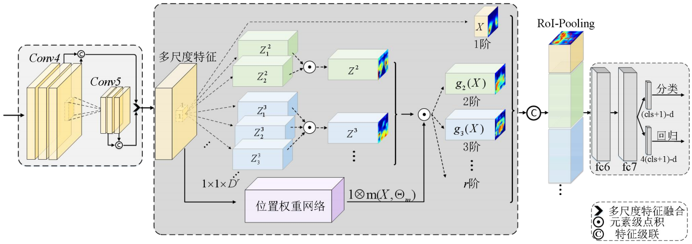

1. 多尺度融合
    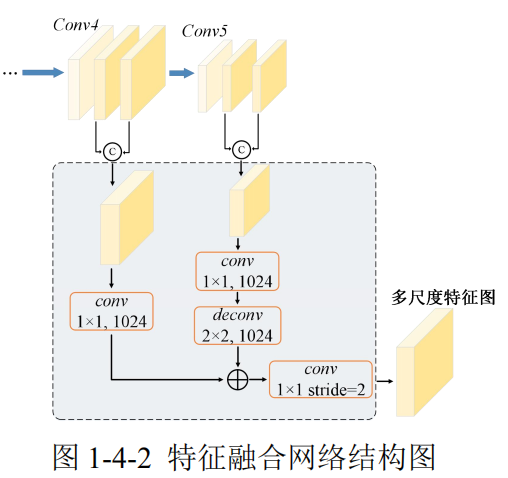
    卷积块内级联，然后不同卷积块的输出相加。
    
    使用反卷积对深层 (分辨率低，尺寸小)卷积块的特征进行**上采样**，并将上采样后的特征与浅层特征相加。

    一个大小为 1 × 1，步 长为 2 的卷积层对融合后的特征**进行下采样**，以保证输出特征的尺寸与原始 Faster R-CNN 的输入一致。
    
2. 核函数表达
   
   MLKP 可以通过使用 1 × 1 卷积及元素级点积得到输入特征的高阶统计表达。公式推导参考PDF或者原论文。

3. 位置权重网络
    
    MLKP 希望在端到端的训练过程中，同时可以学习高阶特征每个点对应的权重： $g_r(X) = Z^{r}\bullet(1\otimes m(X,\theta_m))$

    网络m为一个1×1和3×3和1×1，步长都为1的卷积。

    之后，MLKP使用**重映射**的方法让位置权重与高阶特征具有相同的维度，从而方便与高阶特征$Z^r$进行点积。

    MLKP 可以进行端到端的训练，反传播公式见参考。

整个KMLP目标检测网路结构如下：
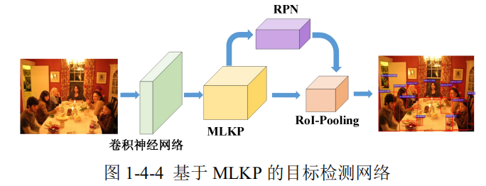

MLKP 与原始 Faster R-CNN 的检测流程基本一致:
- 首先将图像输入到卷积神经网络中
- 然后利用提出 MLKP 模块计算高阶特征表达，同时通过区域预选框网络生成多个预选框。
- 最后，基于 MLKP 生成的高阶特征表达和 RPN 生成的预选框，利用 RoI-Pooling 得到最终的特征表达，完成分类及回归。
- 整个检测网络架构可以进行端到端的训练。

---

## **1.5 FPN**
2017年
### **1.5.1 算法引言**
- 图像金字塔结构是解决多尺度物体检测问题一个常用的方 法，如图 1-5-1 (a)所示，将输入图像调整为不同尺寸，然后得到每种尺寸的检测结果， 并使用非极大值抑制对不同尺寸的结果进行整合，得到最终的检测结果。
    
    为了得到可靠的结果，往往 需要将输入图像调整成多个不同的尺寸，显著地增加了训练和测试的时间复杂度，导致 这种方法很难应用到实际问题中
- 利用卷积神经网络中不同层输出的特征进行检测， 并通过非极大值抑制对结果进行整合以得到最终的检测结果。
  
    不同尺度特征语义差异过大（高分辨率的特征包含的语义信息较少），直接融合所有层的检测结 果会影响最终的性能。
- **FPN**：将分辨率低但语义信息丰富的深层特征与分辨率高但语义信息弱的浅层特征通 过一个带有横向连接的自上而下架构进行级联，从而得到空间分辨率不同且语义信息丰 富的特征图，其网络结构如图 1-5-1 (d)所示。

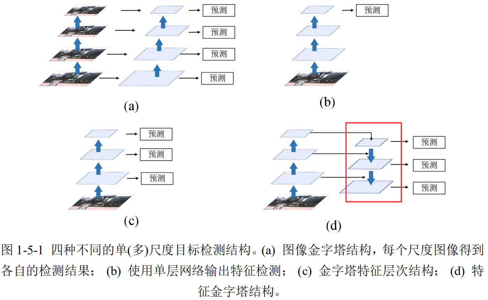

特征金字塔两种不同的预测方式。(a) 仅在最后一层输出特征进行预测；(b) 每层输出特征都进行预测。1-5-1 (d)就是每层都输出特征预测。

### **1.5.2 基础原理**

论文作者使用ResNet作为检测的基础框架，并利用 Faster R-CNN中提出的区域预选框网络生成预选框。FPN 包含三个重要结构，分别为自底向上结构，自顶向下结 构及横向连接结构：

1. 自底向上结构

    对应卷积神经网络的前向传播过程，利用不同卷积块输出不同分辨率 的特征，且这些特征尺寸比例为 2。
    
    FPN 使用每个残差卷积块最后一层输出的特征构成自底向上结 构。conv2，conv3，conv4，conv5 残差卷积块中最后一层输出的特征， 它们与输入图像的尺寸比例分别为{4,8,16,32}。在自底向上结构中，并没有使用残差块 conv1 的输出，因为卷积块 conv1 输出特征包含语义信息较少。
2. 自顶向下及横向连接
   
   自顶向下结构把更抽象、语义更强的深层特征图进行上采样，然后把该特征连接至 前一层特征。
   
   **横向连接的两层特征在空间尺寸上要相同。**
   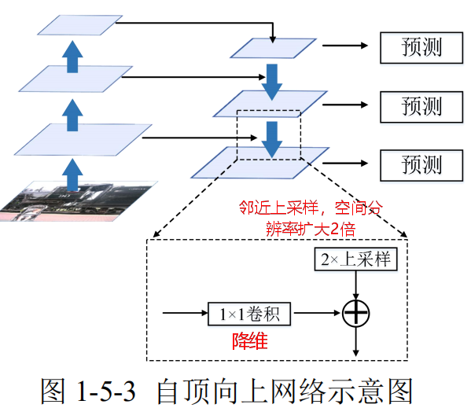

FPN 中每层特征共享**相同的分类及回归网络**，所以需要保证每层输出特征的维度是相同的。FPN 将每个卷积层的维度设置为 256，且没有使用激活层。

1. 与RPN结合
    
    FPN 每层的输出都使用一个3×3 卷积 和两个1 × 1卷积进行分类及回归。不同于 RPN 的锚点框选取方式，FPN 中每层只选取一个尺度的锚点框。

    作者发现特征金字塔结构中的每层网络共享分类及回归参数的检测结果更好。
2. 与Fast RCNN结合

    作者使用 RoI-Pooling 对金字塔结构中每层特征分别进行池化，并把不同特征分配给不同 RoI-Pooling。尺寸较大的目标会被分配到空间分辨率较低的特征层进行预测，尺寸较小的目标会被分配到空间分辨率较高的特征层进行预测，这种分配方式对小物体的检测精度有着明显的提升。分配公式如下：

    $k=\lfloor k_0+\log_2(\sqrt{wh}/224)\rfloor$

    224是输入图像的大小。$k_0$默认设置为4。

---

## **1.6 Mask RCNN**
2017年
### **1.6.1 算法引言**
相对于Fast RCNN ，Mask作出以下改进：
1. 增加一个可以 检测物体掩膜的分支。不仅可以高效的检测图像中的物体，同时也可以为每个实例生成 一个高质量的掩膜 (mask)。这里，掩膜分支可以通过简单的全卷积网络进行实现。
2. 感兴趣区域对齐 (RoI-Aligning)层
   
   用 RoI-Pooling 层将区域预选框映射到卷积神经网络输出特征上，然后将映射后的特征裁剪为相同的尺寸，这种特征提取过程中使用了粗略的空间量化，导致网络输 入与输出不能对齐。

   RoI-Aligning使用了双线性插值的方法。

### **1.6.2 基础原理**

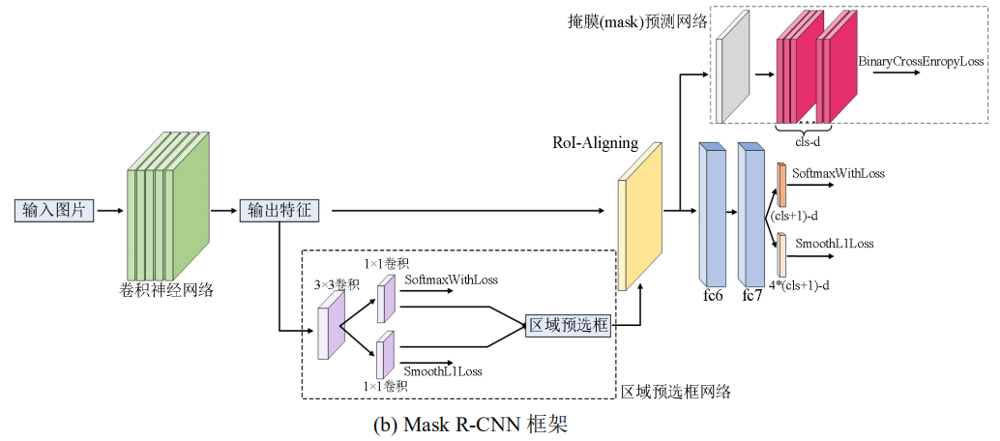

Mask RCNN 也是一个**两阶段目标检测框架**。
- 第一阶段使用 一个区域预选框网络生成多个预选框；
- 第二阶段使用映射后的特征进行分类，回归以及分割。

1. 基于深层卷积网络的特征提取

    Mask R-CNN 即使用了传统的单尺度特征又使用了基于特征金字塔网络的多尺度特征提取方式。

2. RoI-Aligning

    RoI-Pooling有两个量化过程：
     - 将区域预选框映射到卷积神经网络输出特征上，将其边界量化为整数点坐标值；
      - 将量化后的区域预选框区域平均分割成 7 × 7 个区域单元，并对每个单元的边 界进行量化。

    RoI-Aligining使用双线性插值的方法：
    - 遍历每一个区域预选框，保持浮点数边界不做量化
    - 将区域预选框分割成 ݇k × ݇k 个单元，每个单元的边界也不做量化处理
    - 在每个单元中计算四个固定位置坐标，并利用双线性插值计算出这四个位置的值 (具体的插值计算如图 1-6-2 所示)，然后进行最大池化操作。这里固定位置是指在每 一个矩形单元中按照固定规则确定的位置。比如，如果采样点数是 1，那么就是这 个单元的中心点。如果采样点数是 4，那么就是把这个单元平均分割成四个小方块 后，然后对应每个方块对应的中心点。显然这些采样点的坐标通常是浮点数，所以 需要使用插值的方法得到它的像素值。