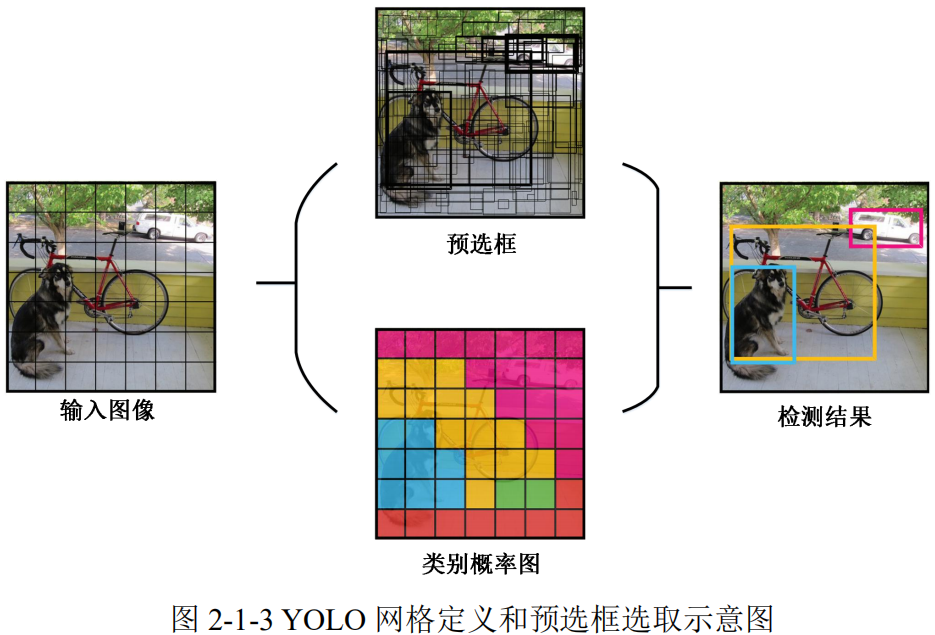
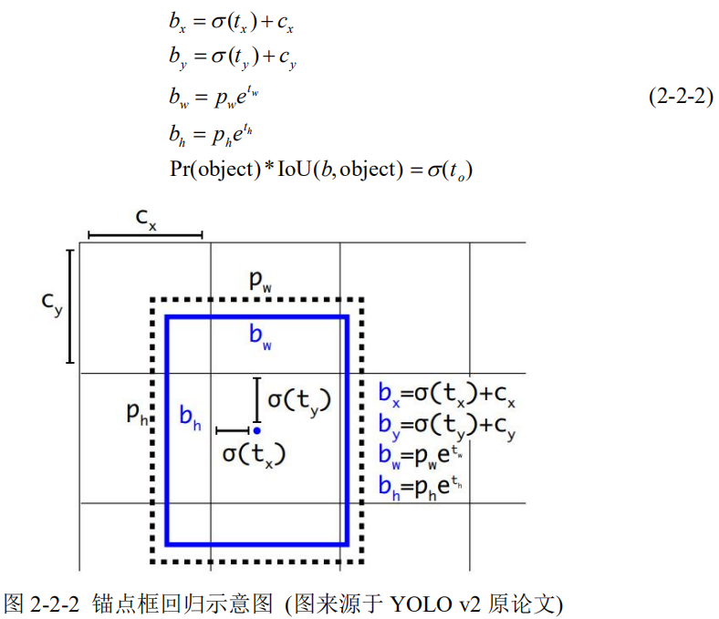
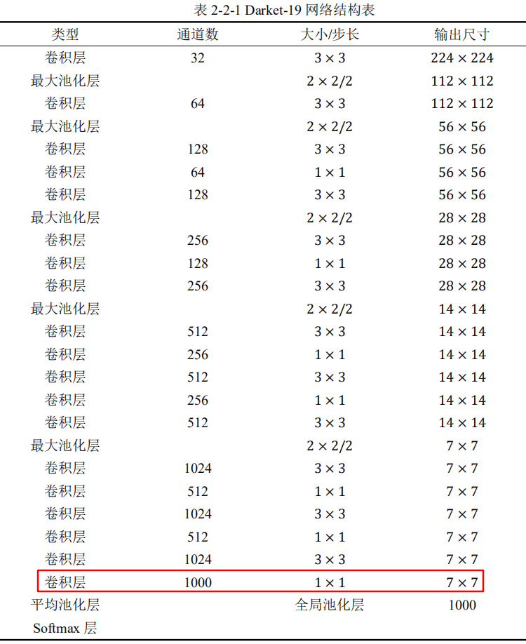
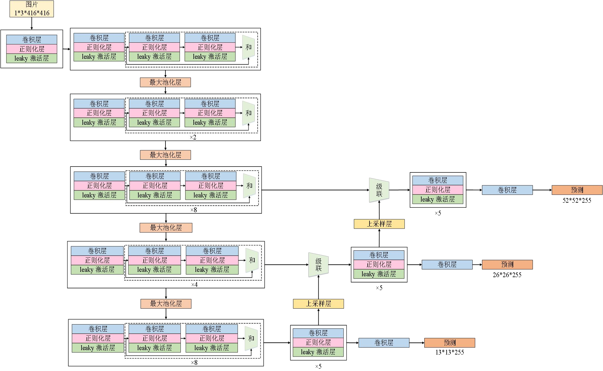
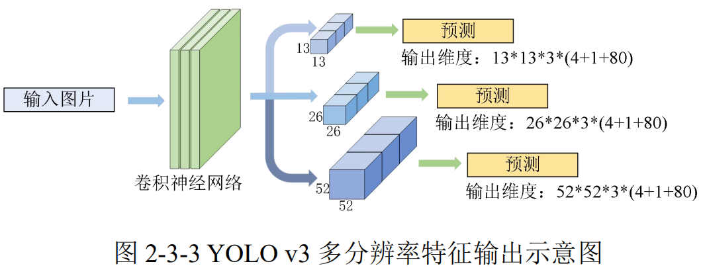
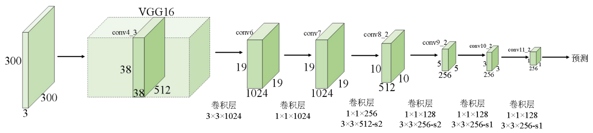
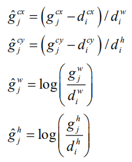
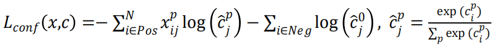

<!-- TOC -->

- [**2 基于深度学习的一阶段目标检测方法**](#2-%e5%9f%ba%e4%ba%8e%e6%b7%b1%e5%ba%a6%e5%ad%a6%e4%b9%a0%e7%9a%84%e4%b8%80%e9%98%b6%e6%ae%b5%e7%9b%ae%e6%a0%87%e6%a3%80%e6%b5%8b%e6%96%b9%e6%b3%95)
  - [**2.1 YOLO**](#21-yolo)
    - [**2.1.1 算法引言**](#211-%e7%ae%97%e6%b3%95%e5%bc%95%e8%a8%80)
    - [**2.1.2 基础原理**](#212-%e5%9f%ba%e7%a1%80%e5%8e%9f%e7%90%86)
  - [**2.2 YOLO v2**](#22-yolo-v2)
    - [**2.2.1 算法引言**](#221-%e7%ae%97%e6%b3%95%e5%bc%95%e8%a8%80)
    - [**2.2.2 基础原理**](#222-%e5%9f%ba%e7%a1%80%e5%8e%9f%e7%90%86)
  - [**2.3 YOLO v3**](#23-yolo-v3)
    - [**2.3.1 算法引言**](#231-%e7%ae%97%e6%b3%95%e5%bc%95%e8%a8%80)
    - [**2.3.2 基础原理**](#232-%e5%9f%ba%e7%a1%80%e5%8e%9f%e7%90%86)
      - [1. 检测网络](#1-%e6%a3%80%e6%b5%8b%e7%bd%91%e7%bb%9c)
      - [2. 分类网络](#2-%e5%88%86%e7%b1%bb%e7%bd%91%e7%bb%9c)
  - [**2.4 SSD**](#24-ssd)
    - [**2.4.1 算法引言**](#241-%e7%ae%97%e6%b3%95%e5%bc%95%e8%a8%80)
    - [**2.4.2 基础原理**](#242-%e5%9f%ba%e7%a1%80%e5%8e%9f%e7%90%86)

<!-- /TOC -->

# **2 基于深度学习的一阶段目标检测方法**
## **2.1 YOLO**
### **2.1.1 算法引言**
1. 速度快。避免了两阶段目标检测框架的复杂流程，直接使用快速的 回归方法处理目标检测问题
2. 背景误检率低。**基于预选框生成**的方法，其感受野只包括预选框内部的局部信息。不同于**基于滑动窗口和预选框生成**的方法，YOLO 在训练和测试过程中通过**对上下文信息编码增加其感受野**，降低了将包含物体的预选框错分为背景的概率；
3. 更强泛化能力以及具有更好的通用性。

### **2.1.2 基础原理**
YOLO 将目标检测归纳为一个回归问题，旨在直接在输入图像的每个像素点上得到物体的预选框坐标及其类别，从而获得最终的检测结果。
1. 调整图片尺寸为 $448 \times 448$
2. 输入网络使用CNN提取特征，进行分类和坐标回归
3. 非极大抑制

YOLO端到端的训练总共分为两大网络：
1. 特征提取网络
   - 卷积层组成的神经网络 ——> 全连接层预测输出类别和坐标
   - 受Google Net启发，该网络架构由23个卷积层和2个全连接层组成
   - 使用$1 \times 1和3\times 3$代替Inception结构

2. 预测网络
   - 检测和分类同时进行
   - 将输入分为$S \times S$的网格，每个网格单元预测$B$个预选框以及其对应的分类置信度
   - **置信度：**$Pr(Object)*IOU^{truth}_{pred]}$。该置信度反应了其所对应的网格是否包含物体的概率以及该预选框与真实边界框之间的准确度。如果不包含真实边界框，则$Pr(Object)=0$。若包含，则置信度定义为预选框和真实边界框的交叠比。
   - 每个预选框包含五个变量：$x,y,w,h,IOU^{truth}_{pred}$。
   - 每个网格单元需要预测是否包含物体$Pr(Class_i|Object)$，并该预测与其对应的预选框的**个数B无关**
   - 每个预选框包含类别$Class_i$的得分为： 
    $Pr(Class_i|Object)*Pr(Object)*IOU^{truth}_{pred}=Pr(Class_i)*IOU^{truth}_{pred}$
   
        即，预选框为类别$Class_i$的概率以及预选框和物体真实框的拟合程度。
    - 例子：杜宇PASCAL VOC数据集，一共包含20个种类。设$S=7,B=2,则最后预测维度为 S\times S\times (B*5+C)=7*7*30$
    

    - **以上步骤存在的一个缺陷**：每个格子可以预测$B$个预选框，但是最终只选择交叠比最高的预选框作为目标 检测的输出。当物体占画面比例较小时，每个格子可能会包含多个物体，但最终只能检测出其中一个。

使用均方和误差作为损失函数：

$Loss=\sum^{S^2}_{i=0} coord\_Error + confidence\_Error + class\_Error$

网络模型参数优化：
1. 位置相关损失（坐标损失、置信度损失）与分类误差对最终网络贡献是不同的。引入$\lambda_{coord}=5$对$coord\_Error$进行约束
2. 不包含物体网格单元的分类置信度将近似为 0，变相放大了包含物体的网格单元的分类损失在计算网络参数梯度时的影响。为了解决这个问题，YOLO使用$\lambda_{noobj}=0.5$对$confidence\_Error$进行约束
3. 相比于大物体的坐标损失，小物体的坐标损失对检测结果影响更大，所以其对应的权重也应该越高。在网络训练过程中，通过对w和h取平方根进行修正来缓解这个问题，但这种方法并未从本质上解决问题。

以下是YOLO最终的损失函数：

损失函数与网络输出关系：

YOLO的训练主要包括两步：
1. 使用ImageNet数据集训练YOLO网络的前20个卷积层和一个全连接层，输入图像尺寸为$224\times 224$ **（训练分类网络）**
2. 使用第一步得到的前 20 层卷积网络参数初始化 YOLO 模型的前 20 个卷积层的参数，然后利用目标检测数据集 (例如，PASCAL VOC)训练整个模型，此时输入图像大小为 448 × 448 **（训练检测网络）**
3. 在测试时，每张图像预测 98 个预选框及其对应的类别，并通过非极大值抑制策略对图像中的每个网格单元预测一个预选框。

YOLO 在训练和测试时间上有了很大的提升，但 其在准确性方面仍然落后当时最先进的目标检测算法 Faster R-CNN。尤其对于图像中 的小物体，YOLO 通常不能进行很好的定位。因此，YOLO 在使用过程中也有如下几点限制：
1. 由于每个像素点仅仅预测两个预选框，因此当图像中的物体距离很近时，**YOLO 无法完整地检测出所有物体，特别是对小物体的检测能力有限**；
2. YOLO 检测框架中**包含多个下采样层，且只使用网络最后一个卷积层的特征进行检测，特征空间分辨率低**，限制了最终的检测性能；
3. YOLO 对小预选框及大预选框使用相同的损失权重，大预选框的损失往往对最终检测结果影响不大，但小预选框的错误对交叠比的影响很大，**定位不准是 YOLO 检测错误的主要来源**。

---

## **2.2 YOLO v2**
### **2.2.1 算法引言**
1. 保证检测准确度的前提下，进一步提高了测试速度
2. YOLO v2 在检测和分类数据集上对目标检测与分类任务进行联合训练，这使得该方法既可以利用标记的检测图像让网络学习定位物体，同时可以使用分类图像来增加网络的词汇量和鲁棒性。
3. 即使在没有训练样本的前提下，YOLO v2 也可以检测到图像中的物体。
4. 最终 通过构建单词树 (Word Tree)，YOLO v2 最多可以检测到 9000 种不同类别的物体。

### **2.2.2 基础原理**
1. **更好的检测准确度**
   - **批量正则化**
   - **使用同样的分辨率训练分类网络和检测网络**
   - **锚点框**。**YOLO 系列方法均使用全连接层进行坐标回归**。不同于 YOLO 这种直接进行预测坐标的方法，Faster R-CNN 使用一些先验知识产生固定尺寸的锚点框，并计算每个锚点框的偏移量以实现回归，从而得到的更好的效果。YOLO v2 参照两阶段目标检测框架中的锚点机制，**摒弃了 v1 版本中的方法。经过一系列的卷积和池化层后**，YOLO v2 最终得到的特征大小为 13 × 13。，YOLO v2 仍然为每个锚点框预测其与真实边界框的交叠比及其类别。但 YOLO v2 使用锚点框后，其数量从 YOLO v1 的每张图像只产生 98 个预选框，变成每张图像产生 1000 多个预选框，预选框数量的增 加也提高了检测的召回率。
    
   **YOLO v2 使用 ݇k-means 聚类 (Cluster) 的方法**得到每个特征点取锚点框的**个数以及每个锚点框的面积及长宽比例**。不同于标准 的 ݇k-means 方法使用欧氏距离度量数据之间的距离，YOLO v2 利用交叠比得分度量锚点框与中心之间的距离： 
    $d(box,centroid)=1-IOU(box,centroid)$
     原论文中通过设置不同的 ݇k值，得到锚点框与其对应的最近的中心点的交叠比，当 ݇k=5 时，复杂度k与召回率之间得到了平衡。因此，YOLO v2 为每个 征点生成 5 种不同的锚点框。
    - **坐标预测**。不同于RPN网络对每个**锚点框与真值框的偏移值**进行回归，YOLO v2 采用与 YOLO v1 相同的方法，即预测每个锚点框与其对应的网格中心点的偏移值。通过使用 logistic 激活方法使网络的预测输出范围限定在[0,1]之间，明显增强了位置回归时的稳定性。 
    YOLO v2 对每个锚点框预测 4 个偏移值$t_x,t_y,t_w,t_h$和一个分类得分$t_o$，前四个变量分别对应坐标偏移值以及长宽比例，可以表示为：
    
    - **使用更精细的特征进行预测**。不同于FPN等方法使用的**多尺度特征提取策略**，YOLO v2 首先对浅层特征进行形状变换，即将分辨率为 26 × 26 × 512 的特征变为分辨率为 13 × 13 × 2048 的特征，然后与最后一层特征进行**级联**， 最终利用级联后的特征进行预测。
    - **多尺度训练**。在 YOLO v1 中只使用分辨率为 448 × 448 的图像训练网络。为了增加网络对不同分辨率的图像的鲁棒性，YOLO v2 使用多尺度输入图像的方法训练网络。在训练过程中，每个批次的图像的分辨率不同，范围在：{320，352，...，608}，其中最小的分辨率为320×320，最大的分辨率为 608 × 608。

2. **更快的训练速度**
   - **Darket-19 处理目标检测问题**。使用 3 × 3的卷积进行特征提取，在每个池化层之后增加卷积通道数。。Darket-19一共包括19个卷积层和5个最大池化层。

        在进行检测任务时，将 Darknet-19 最后一个卷积层利用 3 个 3 × 3的卷积层和两个全连接层代替。
        
        Darknet-19 整体网络架构如下：
        

        对于 PASCAL VOC 数据集而言，一共包含 20 个类别的物体，YOLO v2 为每个特征点预测 5 个锚点框，每个锚点框预测 5 个偏移值，所以最后一个全连接层的 预测维度是 125 维。

3. **更强的检测泛化能力**
    
YOLO v2 提出了一种将分类数据集与检测数据集进行联合训练的方法：
- 使用检测数据集学习定位物体以及对一些常规类别的分类能力。
- 通过使用分类数据集扩展可以检测的物体类别。
- 在训练过程中，YOLO v2 将分类与检测数据集进行混合训练；当输入是检测数据集图像时，对分类和定位损失都进行计算然后更新网络参数；当输入是分类数据集图像时，只对分类损失进行计算并更新网络参数。
- 在联合训练时不能盲目地混合训练数据集，而是需要一个多标签的模型来综合数据集，使类别之间不相互包含。

使用一种多层分类的方法解决上述问题
- 根据 ImangeNet 中包含的概念来建立一个分层树
- 首先检查 ImangeNet 中出现的名词，然后在 WordNet 中找到这些名词，再找到这些名词到达他们根节点的路径。
- 在 WordNet 中，大多数同义词只有一个路径，所以首先把这条 路径中的词全部都加到分层树中。
- 接着迭代地检查剩下的名词，并尽可能少的把他们添加到分层树上，添加的原则就是取最短路径加入到树中。

---

## **2.3 YOLO v3**
### **2.3.1 算法引言**
2018年提出：
要通过修改基础网络架构进一步提高 了检测准确率和计算效率。改进如下：
1. 多尺度预测
2. 改进了基础网络，使用了Darknet-53
3. 改进分类损失，将 SoftMax 损失替换为二值交叉熵损失

### **2.3.2 基础原理**

#### 1. 检测网络

与 YOLO v2 中的 Darknet-19 相同，Darknet-53 也是由一系列的 3 × 3 和 1 × 1 卷积堆叠起来，但使用了**跳跃连接的方法对不同的卷积层进行级联**。

YOLO v3 检测框架图：

    
YOLO v3同样使用Logisitic回归对每个锚点框进行预测。回归过程中只计算得分为1的锚点框对应的损失。YOLO v3 选择 9 个聚类中心，将其按大小均分给 3 不同尺度的特征图 ( 13 × 13͵，26 × 26，52 × 52)，每个尺度的输出如图 2-3-3 所示：
      

由于聚类中心为9，对于每个大小的特征图都有对应三个大小的锚点框。

#### 2. 分类网络
    
对于分类分支，YOLO v3 没有使用多分类 SoftMax 损失函数。SoftMax损失并没有对检测精度的提高有多少帮助，而且每个框只能被判断成一个类别，不适用于有重叠类别标签的数据集 (例如 Open Images)。因此，YOLO v3 使用**多个二分类交叉熵损失进行多标签预测**，对于图片中存在物体相互遮挡的情形时，往往也更具有优势。

[二分类与多分类的交叉熵损失函数](https://www.jianshu.com/p/5139f1166db7)

简单来解释： 二分类最后一层是softmax；多分类最后一层是sigmoid；sigmoid不符合信息熵的分布，因此把最后一层的每个神经元看作是一个二项分布。

---

## **2.4 SSD**
### **2.4.1 算法引言**
**Single Shot MultiBox Detector**

2016年，初衷是为了解决v1的不精确问题。

SSD 首先离散地生成包含不同比例和尺度的默认候选框，然后对每个默认候选框计
算其对应的类别得分和进行坐标回归。

为了增加对不同尺度物体检测的鲁棒性，SSD 使用**多尺度检测**的方法。具体地，SSD 在原始的 VGG16网络后面**加入多个卷积核大小不一的卷积层**，**从而得到多尺度特征**，然后在每层特征上同时进行分类及回归任务。

SSD的优点：
1. 速度比v1快，而且检测准确率也有所提升。
2. 利用多尺度特征进行预测，增加了对不同尺度物体检测的鲁棒性
3. 可以在输入图像分辨率很低的情况下仍然取得较高的检测结果，从而更好
地平衡了检测速度与准确率之间的关系
4. 在公开的 PASCAL VOC[14]和 MS COCO[28]数据上，SSD 取得了当时最佳的效率
和效果均衡性。

### **2.4.2 基础原理**
SSD 使用全卷积网络进行检测，为每个默认候选框都输出分类结果和坐标。然后利
用非极大值抑制的方法对输出的结果进行聚合，从而得到最终的检测结果。

在 VGG 16 网络后增加了16层卷积核大小不同的卷积层，用于多尺度预测。

SSD采用与YOLO v1相同的默认预选框生成策略，即在输出特征上的每个特征点都取一些不同面积与长宽比例的默认预选框。

**SSD 利用多尺度特征进行预测**。假设使用 SSD 中第m层的特征进行预测，则该层特征对应的默认候选框的比例可以表示为：$s_k = s_{min} + \frac{S_{max}-S_{min}}{m-1}(k-1),k \in [1,m]$ 

其中$S_{max}=0.9,S_{min}=0.2$,其分别表示最浅层和最深层的特征比例为 0.2 和 0.9，其余层再0.2和0.9之间。

- 损失函数为分类损失和坐标回归损失组成：
$L(x,c,l,g) = \frac{1}{N}(L_{conf}(x,c)+\alpha L_{loc}(x,l,g)$

$x^p_{ij}$代表检测类别为p时，第i个默认框和第j个真值框是否匹配。如果交叠比大于0.5，则认为时匹配的。N代表$x^p_{ij}=1$的所有默认候选框的个数。

- 当N=0 时，则损失为 0。回归损失为 Smooth L1 损失，可以表示为：
    $L_{loc}(x,l,g)=\sum^N_{i\in Pos}\sum_{m\in [cx,cy,w,h]}x^k_{ij}smooth_{L1}(l^m_i - g'^m_j)$

    其中：
      
    
  - 分类损失为SoftMax多类别损失：

在训练的开始阶段，当默认候选框的数量很大而网络检测能力不足时，很有可能造
成正负样本不均衡的情况，导致几乎所有默认候选框都被检测为负样本，造成网络不收
敛。为了解决这个问题，SSD 将正负样本的比例设置为 1:3，并按照每个默认候选框的
分类得分从高到低进行排序，只选择得分高的默认候选框计算损失。这种方法使得整个
训练过程更加稳定，也加快了收敛速度。

