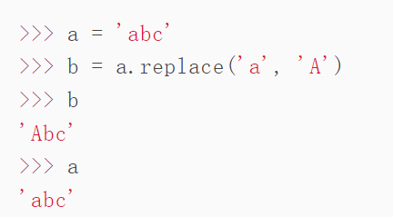

# Python基础

## Python的基本类型
- python3中取消<>
- python3中/得到浮点数
- 单个字符：
  - ord()：获取单个字符的整数表示
  - chr()：把编码转化为对于的单个字符
- str
  - str是不可变对象
  - 'ABC'和b'ABC'，Python字符串类型str以及bytes类型。bytes类型仅占用一个字节，str需要转化为bytes用于网络传输或者保存到磁盘。
  - 'str'.encode(编码类型)：转化为bytes
  - 'bytes'.decode(编码类型，errors='ignore')：转化为str，errors设定忽略错误字节
  - len('str')：计算字符数
  - len('bytes')：计算字节数
  - int('str')：把字符串转为数字，字符串包含非数字将会报错
  - $#-*- coding: utf-8 -*-$：告诉Python编译器使用UTF-8
- 格式化：
  - %s 字符串, %d 整数, %f 浮点数, %x 十六进制整数
  - %s永远起作用，它会把任何数据类型转换为字符串
  - format()：它会用传入的参数依次替换字符串内的占位符{0}、{1}
- List
  - 有序集合，添加和删除元素
  - []
  - len(list)
  - list[index] _ indexError
  - list.append()
  - list.insert(index,value)
  - list.pop()，list.pop(index)
  - list元素数据类型可以不填
- Tuple
  - tuple也是有序列表，但是一旦初始化后就不能修改
  - 没有append，pop这类方法
  - tuple[index]
  - tuple定义时，只有1个元素的tuple定义时必须加一个逗号,，来消除歧义
  - tuple中list元素可以变，这是因为tuple不变的意思是指向的对象不变

## Python基本逻辑
- 条件判断if
  - if condition :
  - elif condition:
  - else:
- 循环
  - for subVar in var:
  - break跳出最近的循环
  - continue
- dict
  - 内置字典dict，使用key-value存储，快速查找速度
  - {}
  - dict[key]：写入或读取value值
  - key in dict：判断key是否存在
  - dict.get(key,NoneValue)：如果key不存在，返回NoneValue，默认为None
  - dict.pop(key)
  - dict是不可变对象。

    根据key来计算value的存储位置，如果每次计算相同的key得出的结果不同，那dict内部就完全混乱了。这个通过key计算位置的算法称为哈希算法（Hash）。Python中，字符串、整数等都是不可变的，因此，可以放心地作为key。而list是可变的，就不能作为key。
- set
  - set也是一组key的集合，但不存储value。
  - key是不能重复的，因此set是无序，无重复元素的
  - 要创建一个set，需要提供一个list作为输入集合
  - {}
  - add(key)
  - remove(key)
  - s1 & s2 交集
  - s1 | s2 并集
- 不可变对象
  - str是不可变对象，llist是可变对象。因此list中的元素可以随意修改。但是对于str来说：
    
    a指向的是'abc'字符串对象。replace方法是创建了一个新的字符串并返回，而没有改变原来的'abc'。
- 所以，对于不变对象来说，调用对象自身的任意方法，也不会改变该对象自身的内容。相反，这些方法会创建新的对象并返回，这样，就保证了不可变对象本身永远是不可变的。

- 数据类型转化
  - int()
  - float()
  - str()
  - bool()
- 列表生成式
  - list(range(1,11))
  - [x * x for x in range(1, 11)]
  - [x * x for x in range(1, 11) if x % 2 == 0] 选出仅偶数的平方
- 生成式
  - L = [x * x for x in range(1, 11)] L是一个list
  - g = (x * x for x in range(1, 11)) g是一个generator
  - next(g)可以得到下一个返回值 或者 for n in g:
  - 如果一个函数定义中包含yield关键字，那么这个函数就不再是一个普通函数，而是一个generator
  - 在执行过程中，遇到yield就中断，下次又继续执行。