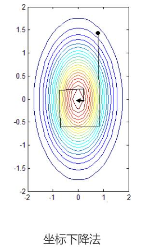

## [真正理解拉格朗日乘子法和KKT条件](https://www.cnblogs.com/xinchen1111/p/8804858.html)
<!-- TOC -->

- [[真正理解拉格朗日乘子法和KKT条件](https://www.cnblogs.com/xinchen1111/p/8804858.html)](#真正理解拉格朗日乘子法和kkt条件httpswwwcnblogscomxinchen1111p8804858html)
    - [**1. 无约束优化问题**](#1-无约束优化问题)
    - [**2. 一定约束条件的情况下最小化目标函数**](#2-一定约束条件的情况下最小化目标函数)
    - [**3. 有等式约束，又有不等式约束的优化问题**](#3-有等式约束又有不等式约束的优化问题)

<!-- /TOC -->
- 拉个朗日乘子法是为了解决有约束优化问题

### **1. 无约束优化问题**
首先先从无约束优化问题讲起，一般就是要使一个表达式取到最小值： $\min f(x)$
如果问题是$\max f(x)$可以通过取反转化为求最小值 $\min -f(x)$，这是一个习惯。对于这类问题，我们可以直接对每个变量求偏导，让每个偏导等于0，然后解方程组就行了。
    
  

极值点示意图

所以在极值点处一定满足$\frac{df(x)}{dx}=0$，这只是必要条件。求出$x$之后，带入函数验证它是否真的是极值点就行了。对于有些可以直接通过这种方法求出解析解（如最小二乘法）。

但是也有很多问题解不出来或者很难解，所以就需要梯度下降法、牛顿法、坐标下降法之类的数值迭代算法了（感知机 、logistic 回归中用到）。

对于这些迭代算法就像下面这张图一样，我们希望找到其中的最小值。一个比较直观的想法是先找一个起点，然后不断向最低点靠近。就先把一个小球放到一个碗里一样。
    

  一开始要找一个起始点，然后确定走的方向和距离，最后还要知道什么时候停止。这三步中最难的应该是确定走的方向。走的慢点还可以接受，要是方向错了就找不到最小值了~所以走的距离可以简单的设为一个比较小的值。起始点可以随机选一个 $(x_0,y_0)$。关键是方向，可以选择 $(x_0,y_0)$处的梯度的反方向，这是函数在这个点下降最快的方向（原因可以看知乎中忆臻的回答）。

它是一个向量，然后它的大小就是走的距离，为了防止太大而走过头，导致不断在最小值附近震荡，需要乘上一个比较小的值（称为学习率），最终的停止条件就是梯度的大小很接近于 0（在极值点处的梯度大小就是 0）就行了。这种方法依靠梯度确定下降方向的方法叫做**梯度下降法**。
对 $f(x)$ 求极小值的流程就是：

1. 随机选定$x_0$
2. 得到函数在$x_0$的梯度，然后从$x_0$向前走一步。计算式是$x^{new}_0 = x^{old}_0 - \alpha\nabla f(x)$
3. 重复第2步，知道梯度接近于$o$(事先设定的很小的数)，或者达到指定迭代上限

   
除了这种方法之外，其中第 2 步还可以这样做，固定 x, 把它作为常数。就变成只有一个变量的优化问题了，直接求导为 0 就可以得到最优点，向前走到 $(x_0,y_1)$ 处，然后固定 $y_1$, 对$x$进行相同的操作。这种每次只优化一个变量的方法叫做**坐标下降法**。

### **2. 一定约束条件的情况下最小化目标函数**
然后就是进一步的，我们可能要在满足一定约束条件的情况下最小化目标函数，比如有一个等式约束：
> $\min f(x)$
>
> $s.t. \quad h(x)=0$

解决这个的时候问题不能先用上面的方法求出 $f(x)$ 的极值点，然后留下满足方程 $h(x)=0$ 的。因为这个问题的解可能根本不是 $minf(x)$ 的解，它们是没有关系的。那么还是要从问题本身去找线索：

如图，其中的圆圈是指目标函数 $f(x，y)$ 投影在平面上的等值线，表示在同一个圆圈上，黑线是约束条件 $h(x)=0$ 的函数图像。

所以等值线与函数图像相交的点其实就是所有满足约束的点。那么**极值点只有可能在等值线与函数图像相切的地方取到**，因为如果在相交的地方取到，那么沿着 $h(x)$ 的图像往前走或者往后走，一定还有其它的等值线与它相交，也就是 $f(x,y)$ 的值还能变大和变小，所以交点不是极值点，只有相切的时候才有可能是极值点(不可能同时变大和变小了)。

在相切的地方 $h(x)$ 的梯度和 $f(x,y)$ 的梯度应该是在同一条直线上的。（这一点可以这么想，在切点处两个函数的梯度都与切平面垂直，所以在一条直线上）

所以满足条件的极值点一定满足：$∇f(x,y)=λ∇h(x,y)$ ( λ=0 是允许的，表示 $f(x,y)$ 本身的极值点刚好在切点上)，然后和原来的等式方程$h(x,y)=0$联立，然后只要解出这个方程组，就可以得到问题的解析解了。当然也存在解不出来的情况，就需要用罚函数法之类的方法求数值解了。

为了方便和好记，就把原来的优化问题写成 $f(x,y)+λh(x,y)$ 的形式，然后分别对 $λ,x,y$ 求偏导，并且令偏导为 0 就行了，和之前得到的方程组是一样的。这种方法叫**拉格朗日乘数法**。

如果有多个等式约束怎么办呢，如下图：

这里的平面和球面分别代表了两个约束 $h1(x)$ 和 $h2(x)$，那么这个问题的可行域就是它们相交的那个圆。这里蓝色箭头表示平面的梯度，黑色箭头表示球面的梯度，那么**相交的圆的梯度就是它们的线性组合**（只是直观上的~），所以在极值点的地方目标函数的梯度和约束的梯度的线性组合在一条直线上。所以就满足：
>$∇f(x)=λ∑_i^2μ_i∇h_i(x)=∑_i^2λ_i∇h_i(x)$
>
>约束条件：$h_1(x)=0 \quad h_2(x)=0$

大于2个约束的情况也一样。为了好记，将原来的约束的问题写成:$L(x,\lambda)=f(x)+\sum_{i=1}^n \lambda\nabla h_i(x)$ ，然后对$x,\lambda$求偏导，然后让他们为$0$。结果像上面一样直接列方程组是一样的。这个可以看做是一种简记，或者是对偶问题，这个函数叫做**拉格朗日函数**。

### **3. 有等式约束，又有不等式约束的优化问题**
再进一步，如果问题中既有等式约束，又有不等式约束怎么办呢？对于：
>$minf(x)$
>
>$s.t. \quad h(x)=0 \qquad g(x)≤0$

当然也同样约定不等式是 ≤，如果是 ≥ 只要取反就行了。对于这个问题先不看等式约束，对于不等式约束和目标函数的图：

阴影部分就是可行域，也就是说可行域从原来的一条线变成了一块区域。那么能取到极值点的地方可能有两种情况：
1. 还是在 h(x) 和 等值线相切的地方
2. f(x) 的极值点本身就在可行域里面。

因为如果不是相切，那么同样的，对任意一个在可行域中的点，如果在它附近往里走或者往外走，$f(x)$ 一般都会变大或者变小，所以绝大部分点都不会是极值点。除非这个点刚好在交界处，且和等值线相切；或者这个点在可行域内部，但是本身就是 $f(x)$ 的极值点。如下图（维基百科上的图~）：

对于第一种情况，不等式约束就变成等式约束了，对$f(x)+λh(x)+μg(x)$ 用拉格朗日乘子法：
    
$∇f(x)+λ∇h(x)+μ∇g(x)=0$

    
$h(x)=0$

    
$g(x)=0$

    
$μ≥0$

这里需要解释一下，为什么不是 $μ≠0$ 而是 $μ≥0$。后面的约束比前面的更强。看“不等式约束”那个图，我们已经知道了问题中的可行域是在 $g(x)≤0$ 一侧，而 $g(x)$ 的梯度是指向大于 0 的一侧，也就是不是可行域的一侧。而求的问题是极小值，所以 $f(x)$ 在交点处的梯度是指向可行域的一侧，也就是说两个梯度一定是相反的。所以也就可以确定这里的系数一定是大于 0 的。而等式约束由于不知道 $h(x)$ 的梯度方向，所以对它没有约束，那么为什么 μ 还能等于 0 呢，因为极值点可能刚好在 $g(x)$ 上。

对于第二种情况，不等式约束就相当于没有，对 $f(x)+λh(x)$ 用s：

∇f(x)+λ∇h(x)=0

h(x)=0

g(x)≤0

最好把两种情况用同一组方程表示出来。对比一下两个问题，不同的是第一种情况中有 μ≥0 且 g(x)=0, 第二种情况 μ=0 且 g(x)≤0 。综合两种情况，可以写成 μg(x)=0 且 μ≥0 且 g(x)≤0：

∇f(x)+λ∇h(x)+μ∇g(x)=0

h(x)=0

μg(x)=0

μ≥0

g(x)≤0

这个就是 **KKT 条件**。它的含义是这个优化问题的极值点一定满足这组方程组。（不是极值点也可能会满足，但是不会存在某个极值点不满足的情况）它也是原来的优化问题取得极值的必要条件，解出来了极值点之后还是要代入验证的。但是因为约束比较多，情况比较复杂，KKT 条件并不是对于任何情况都是满足的。要满足 KKT 条件需要有一些规范性条件（Regularity conditions），就是要求约束条件的质量不能太差，常见的比如：
1. LSQ:如果 $h(x)$ 和 $g(x$) 都是形如 $Ax+b$ 的仿射函数，那么极值一定满足 KKT 条件。
2. LICQ:起作用的 $g(x)$ 函数（即 $g(x)$ 相当于等式约束的情况）和 $h(x)$ 函数在极值点处的梯度线性无关，那么极值一定满足 KKT 条件。
3. Slater 条件：如果优化问题是个凸优化问题，且至少存在一个点满足 $h(x)=0$ 和 $g(x)=0$，极值一定满足 KKT 条件。并且满足强对偶性质（下面会讲）。

这里的 Slater 条件比较重要，因为它可以推导出强对偶性质（下面会讲到，它比 KKT 条件还好）。它需要原问题是凸优化问题。所谓凸优化就是这个优化问题的优化函数是凸函数，并且可行域是凸集。可行域数凸集就要求其中的 h(x)≤0 的条件中 h(x) 必须也是凸函数，而 g(x)≤0 中的 g(x) 必须是 Ax+b 形式的，也就是仿射函数（比如二维的情况，可行域就在 g(x) 这条曲线上，那么 g(x) 必须得是直线才能满足凸集的定义）。

如果有多组不等式约束 $g_i(x)≠0(i=1,..,n)$, 和等式约束 $h_i(x)=0(i=1,..,n)$也是一样，只要做个线性组合就行了：

问题到这里就大致解决了，KKT 条件虽然从理论上给出了极值的必要条件，但是一般实际解的时候直接方程也是很困难的（特别是约束很多的时候），一般也会采用罚函数法等数值方法。

为了更好的解决这个优化问题，数学家还找到了它的对偶问题。找一个优化问题的对偶问题的一般因为是对偶问题比原问题更好解决，并且对偶问题的解和原问题是一样的。上面的拉格朗日函数也可以看做原问题的对偶问题。

为了去掉问题中的约束，可以把它们作为惩罚项加到目标函数中 $min_xf(x)+Mh(x)+Ng(x)$ 其中 $M, N$ 是两个很大的正数，在数值解法中可以直接这样做，这个就是罚函数法的思路 。不过在理论推导时这样做是不严谨的，除非 $M, N$ 为无穷大。所以就把原问题改写$L(x,μ,λ)=min_xmax_{μ,λ}f(x)+λh(x)+μg(x)$。

这个式子可以这么理解，现在外层给定任意一个 $x_0$ 值，然后内层在给定的 $x_0$ 下优化那个函数，让它最小。然后外层选能够让内层得到的值最大的一个 $x_0$，得到的函数表达式就是：$L(x,\mu,\lambda)=\left\{ \begin{aligned}
f(x) : (x ，满足约束))\\
 \infty: (x ，不满足约束)\\
\end{aligned} \right\}$

所以外层选的那个 $x_0$ 一定满足约束，否则，内层的 max 的时候会让 μ 或者 λ 为无穷大。外层不会选那些能让内层得到无穷大的 x 值。这样改写就和原来的带约束形式完全一致了，但是形式不同。这样可以利用 $max(minf(x))≤min(max(f(x))$ 这个公式（这个很好理解，$minf(x)≤min(maxf(x))$, 然后就有这个公式了），得到原问题的最小值的一个下界，就是:

$min_xmax_{μ,λ}f(x)+λh(x)+μg(x)≥max_{μ,λ}min_xf(x)+λh(x)+μg(x)$

前面的就是原函数，后面的是它的一个下界。那么为什么要这样做呢? 是因为后面的一定是一个凸规划(理论上证明了的)，比较好解决。但是这个只是一个下界，它们之间还是有一定的差距。这个差距叫对偶误差（duality gap）。**对偶误差如果为 0 其实是一个非常好的性质**，表示可以直接求解后面的问题得到原问题的解，这种性质叫**强对偶性质，否则就只是弱对偶**。

强对偶性质非常好，但是要求也很苛刻，比 KKT 条件要苛刻。如果问题满足强对偶一定也满足 KKT 条件，反之不一定。对于这类优化问题，KKT 条件、强对偶、规范性条件之间的关系是：

