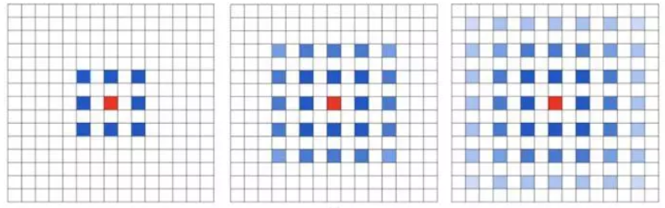
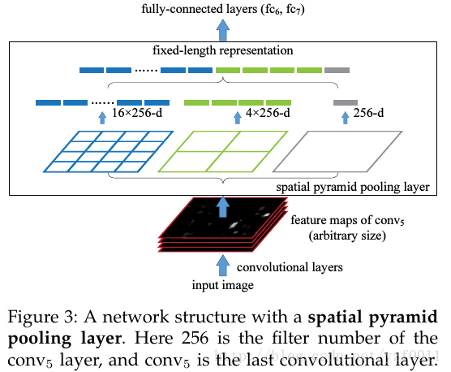
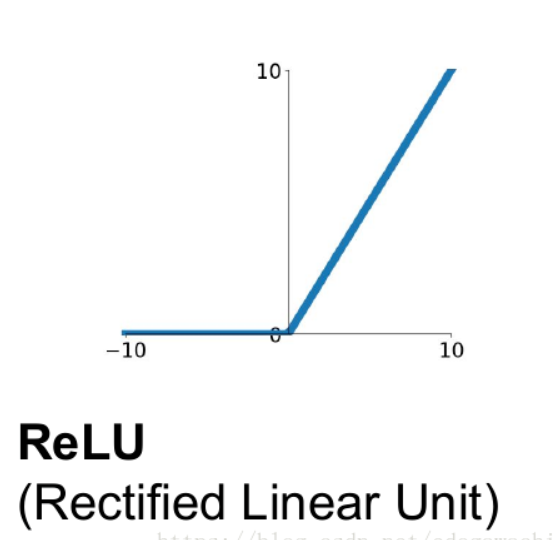

<!-- TOC -->

- [**Convolutional Layer**](#convolutional-layer)
  - [**卷积层基础概念**](#%e5%8d%b7%e7%a7%af%e5%b1%82%e5%9f%ba%e7%a1%80%e6%a6%82%e5%bf%b5)
  - [**广义线性模型**](#%e5%b9%bf%e4%b9%89%e7%ba%bf%e6%80%a7%e6%a8%a1%e5%9e%8b)
  - [**关于 CNN对图像特征的 位移、尺度、形变不变性的理解**](#%e5%85%b3%e4%ba%8e-cnn%e5%af%b9%e5%9b%be%e5%83%8f%e7%89%b9%e5%be%81%e7%9a%84-%e4%bd%8d%e7%a7%bb%e5%b0%ba%e5%ba%a6%e5%bd%a2%e5%8f%98%e4%b8%8d%e5%8f%98%e6%80%a7%e7%9a%84%e7%90%86%e8%a7%a3)
  - [**Shit-Invariance位移不变性**](#shit-invariance%e4%bd%8d%e7%a7%bb%e4%b8%8d%e5%8f%98%e6%80%a7)
  - [**平铺卷积网络 Tiled Convolution**](#%e5%b9%b3%e9%93%ba%e5%8d%b7%e7%a7%af%e7%bd%91%e7%bb%9c-tiled-convolution)
  - [**图像卷积与反卷积 Transposed Convolution**](#%e5%9b%be%e5%83%8f%e5%8d%b7%e7%a7%af%e4%b8%8e%e5%8f%8d%e5%8d%b7%e7%a7%af-transposed-convolution)
  - [**空洞卷积 Dilated Convolution**](#%e7%a9%ba%e6%b4%9e%e5%8d%b7%e7%a7%af-dilated-convolution)
    - [**解决的问题**](#%e8%a7%a3%e5%86%b3%e7%9a%84%e9%97%ae%e9%a2%98)
    - [**Dilated conv的问题**](#dilated-conv%e7%9a%84%e9%97%ae%e9%a2%98)
  - [**Network In Network——卷积神经网络的革新**](#network-in-network%e5%8d%b7%e7%a7%af%e7%a5%9e%e7%bb%8f%e7%bd%91%e7%bb%9c%e7%9a%84%e9%9d%a9%e6%96%b0)
    - [**文章的新点：**](#%e6%96%87%e7%ab%a0%e7%9a%84%e6%96%b0%e7%82%b9)
    - [**mplconv 结构的提出：**](#mplconv-%e7%bb%93%e6%9e%84%e7%9a%84%e6%8f%90%e5%87%ba)
    - [**global average pooling 结构：**](#global-average-pooling-%e7%bb%93%e6%9e%84)
  - [**Inception Module / GoogleNet**](#inception-module--googlenet)
    - [**1×1卷积**](#1%c3%971%e5%8d%b7%e7%a7%af)
    - [**Inception Module**](#inception-module)
- [**Pooling Layer**](#pooling-layer)
  - [**L_p Pooling**](#lp-pooling)
  - [<b>Mixed Pooling</b>](#bmixed-poolingb)
  - [<b>Stochastic Pooling</b>](#bstochastic-poolingb)
  - [<b>Spectral(光谱) Pooling</b>](#bspectral%e5%85%89%e8%b0%b1-poolingb)
  - [**Spatial Pyramid Pooling**](#spatial-pyramid-pooling)
  - [<b>Multi-scale Orderless Pooling</b>](#bmulti-scale-orderless-poolingb)
  - [**VLAD && BoW && Fisher Vector && Global CNN**](#vlad--bow--fisher-vector--global-cnn)
- [**Activation Function**](#activation-function)
  - [**激活函数的饱和性**](#%e6%bf%80%e6%b4%bb%e5%87%bd%e6%95%b0%e7%9a%84%e9%a5%b1%e5%92%8c%e6%80%a7)
  - [**ReLU**](#relu)
  - [**Leaky ReLU**](#leaky-relu)
  - [**Parametric ReLU**](#parametric-relu)
  - [**Randomized ReLU**](#randomized-relu)
  - [**ELU**](#elu)
  - [**Maxout**](#maxout)
  - [**Probout**](#probout)
  - [**sigmoid && tanh**](#sigmoid--tanh)

<!-- /TOC -->

# **Convolutional Layer**

## **卷积层基础概念**

[参考](https://blog.csdn.net/zhq9695/article/details/84959472)

## **广义线性模型**
[参考](https://blog.csdn.net/weixin_37140379/article/details/82289704)

## **关于 CNN对图像特征的 位移、尺度、形变不变性的理解**
[参考](https://blog.csdn.net/voxel_grid/article/details/79275637)

## **Shit-Invariance位移不变性**

[位移不变性](https://www.cnblogs.com/fydeblog/p/11083664.html)
  - 什么是平移等方差（Shift-equivariance）？ [参考](https://www.cnblogs.com/fydeblog/p/11083664.html)
    >答：$Shift_{\Delta h, \Delta w}(\widetilde{\mathcal{F}}(X))=\widetilde{\mathcal{F}}\left(\text { Shift }{\Delta h, \Delta w}(X)\right) \quad \forall(\Delta h, \Delta w)$，可以看到输入在$(\Delta h, \Delta w)$变化，输出对应的输出在$(\Delta h, \Delta w)$变化。

  - 什么是平移不变性（Shift-invariance）？

    >答：$\widetilde{\mathcal{F}}(X)=\widetilde{\mathcal{F}}\left(\text { Shift }_{\Delta h, \Delta w}(X)\right) \quad \forall(\Delta h, \Delta w)$， 输入在$(\Delta h, \Delta w)$变化，不改变最后的结果。

    大多数现代的卷积网络是不具有平移不变性的（如上所示，右边是作者提出的方法BlurPool），而不具有平移不变性的原因是因为maxpooling，strided-convolution以及average-pooling这些下采样方法忽略了抽样定理

[参考视频](https://www.bilibili.com/video/av63925068)
    
---

## **平铺卷积网络 Tiled Convolution** 
[参考](https://blog.csdn.net/xiao_jiang2012/article/details/9349955) 
CNN基于两个关键性质：
  - 局部接收域 ——计算的目的
  - 权重共享——学习平移不变性。

1. 权重共享的缺点：不能学习到其他的不变性，如旋转，尺度等，因为权重相同，等于第二层的池化单元是对相同基函数的池化。
2. 为了在计算量和不变性之间权衡，提出TCNN，即相邻单元间的权重不相同，距离远的单元权重相同。规定，只有相距k个单元的隐藏单元的权重相同。如果k=1，变为CNN。
3. 为了学习到过完备集，我们允许多映射（multiple “maps“），即在一个局部接收域用多个滤波器学习多个特征特征。

---

##  **图像卷积与反卷积 Transposed Convolution**
[参考](https://blog.csdn.net/qq_38906523/article/details/80520950)

 [CNN中的卷积和反卷积](https://blog.csdn.net/sinat_29957455/article/details/85558870)
  
---

##  **空洞卷积 Dilated Convolution**
[参考](https://www.jianshu.com/p/f743bd9041b3)

> Dilated/Atrous Convolution(中文叫做空洞卷积或者膨胀卷积) 或者是 Convolution with holes 从字面上就很好理解，是在标**准的 convolution map 里注入空洞，以此来增加 reception field**。相比原来的正常convolution，dilated convolution 多了一个 hyper-parameter 称之为**dilation rate 指的是kernel的间隔数量**(e.g. 正常的 convolution 是 dilatation rate 1)

### **解决的问题**
Deep CNN 对于其他任务还有一些致命性的缺陷。较为著名的是 up-sampling 和 pooling layer 的设计。
主要问题有：

1. Up-sampling / pooling layer (e.g. bilinear interpolation) is deterministic. (参数不可学习)
2. 内部数据结构丢失；空间层级化信息丢失。
3. 小物体信息无法重建 (假设有四个pooling layer 则任何小于 2^4 = 16 pixel 的物体信息将理论上无法重建。)

在这样问题的存在下，语义分割问题一直处在瓶颈期无法再明显提高精度， 而 dilated convolution 的设计就良好的避免了这些问题。

在图像分割领域，图像输入到CNN（典型的网络比如FCN[3]）中，FCN先像传统的CNN那样对图像做卷积再pooling，降低图像尺寸的同时增大感受野，但是由**于图像分割预测是pixel-wise的输出**，所以要将pooling后较小的图像尺寸**upsampling**到原始的图像尺寸进行预测（upsampling一般采用deconv反卷积操作），之前的pooling操作使得每个pixel预测都能看到较大感受野信息。之前的pooling操作使得每个pixel预测都能看到较大感受野信息。

因此图像分割FCN中有两个关键，**一个是pooling减小图像尺寸增大感受野，另一个是upsampling扩大图像尺寸**。在先减小再增大尺寸的过程中，肯定有一些信息损失掉了，那么能不能设计一种新的操作，不通过pooling也能有较大的感受野看到更多的信息呢？答案就是**Dilated conv**。

**Dilated conv**的好处是不做pooling损失信息的情况下，加大了感受野，让每个卷积输出都包含较大范围的信息。

### **Dilated conv的问题**
**1. 潜在问题 1：The Gridding Effect**
   
   假设我们仅仅多次叠加 dilation rate 2 的 3 x 3 kernel 的话，则会出现这个问题：
   
   我们发现我们的 kernel 并不连续，也就是并不是所有的 pixel 都用来计算了，因此这里将信息看做 checker-board 的方式**会损失信息的连续性**。**这对 pixel-level dense prediction 的任务来说是致命的。**

**2. 潜在问题 2：Long-ranged information might be not relevant.远距离信息可能是不相关的**
   
   我们从 dilated convolution 的设计背景来看就能推测出这样的设计是用来获取 long-ranged information。然而**光采用大 dilation rate 的信息或许只对一些大物体分割有效果，而对小物体来说可能则有弊无利了**。如何同时处理不同大小的物体的关系，则是设计好 dilated convolution 网络的关键。

 

---
## **Network In Network——卷积神经网络的革新**
[参考](https://www.cnblogs.com/yinheyi/p/6978223.html)

引用：Lin M, Chen Q, Yan S. Network in network[J]. arXiv preprint arXiv:1312.4400, 2013.

### **文章的新点：**
1. 采用 mlpcon 的结构来代替 traditional 卷积层； 

2. remove 卷积神经网络最后的 全连接层，采用 global average pooling 层代替；

### **mplconv 结构的提出：**

conventional 的卷积层 可以认为是linear model , 为什么呢，因为 局部接收域上的每每一个tile 与 卷积核进行加权求和，然后接一个激活函数；**它的 abstraction 的能力不够， 对处理线性可分的的 concept 也许是可以的，但是更复杂的 concepts 它有能力有点不够了**，所以呢，需要引入 more potent 的非线性函数；

基于此，提出了 mlpcon 结构，它用多层的感知器（其实就是多层的全连接层）来替代单纯的卷积神经网络中的 加 权求和； mlpcon 指的是： **multilayer perceptron + convolution**;

两者的结构如下所示：其中下图的 Mlpconv 的有两层的隐含层；

  
> 说明：在mlpconv中的每一层的后面都跟着一个 ReLU激活函数；用于加入更多的nonlinearity;

### **global average pooling 结构：**

卷积神经网络最后的全连接层可以说作为了一个分类器，或者作为了一个 feature  clustering。

它把卷积层学习到的特征进行最后的分类；   intuitively, 根本不了解它是怎么工作的， 它就像一个黑盒子一样，并且它也引入了很多的参数，会出现 overfitting 现象；   （我认为其实最后的 全接层就是一个分类器）

本文，remove掉了 全连接层， 使用 global average pooling 来代替； 举个例子更容易说明白： 假设分类的任务有100 classes，  所以设置网络的最后的 feature maps 的个数为 100， 把每一个feature map 看作成 对应每一类的 概率的相关值 ，然后对每一个 feature map 求平均值（即 global average pooling), 得到了 100维的向量， 把它直接给 softmax层，进行分类；（其实100个数中最大值对应的类别即为预测值， 之所以再送给 softmax层是为了求 loss，用于训练时求梯度）

- 在卷积神经网络中，无论是输入还是输出，不同的 feature map 之间的卷积核是不相同的；
- 在mlpconv中，不同的 feature map 之间的开头与能结尾之间的权值不一样，而在 隐含层之间的权值是共享的；

> 1×1卷积首先是出现在Network in Network这篇论文当中，作者想要让网络变得更深，但并不是简单的去增加神经网络的层数。根据Aaditya Prakash (Adi)的观点，其实从某冲深度来讲用1×1卷积并不是使网络变得更深，而是更宽，这里的宽实际上是增加数据量，**但是通过1×1的卷积我们就可以对原始图片做一个变换，得到一张新的图片，从而可以提高泛化的能力减小过拟合;同时在这个过程中根据所选用的1×1卷积和filter的数目不同，可以实现跨通道的交互和信息的整合，而且还可以改变图片的维度.而且因为通过对维度的操作，虽然网络的层数增加了，但是网络的参数却可以大大减小，节省计算量**。在实际应用的过程中，通常在卷积之后就跟着一个Relu之类的非线性层，把卷积的线性变成非线性，**通过这个可以增加更多的非线性因素**，理论上学习到更多的特征，包持feature map 尺寸不变（即不损失分辨率）的前提下大幅增加非线性特性，把网络做得很deep

【具体结构请参考前面的链接~】

---
## **Inception Module / GoogleNet**

###  **1×1卷积**
  - [1 × 1 卷积](https://blog.csdn.net/renhaofan/article/details/82721868)
   -  作用1：在相同尺寸的感受野中叠加更多的卷积，能提取到更丰富的特征。这个观点来自于Network in Network(NIN, https://arxiv.org/pdf/1312.4400.pdf)，图1里三个1x1卷积都起到了该作用
   -  作用2：使用1x1卷积进行降维，降低了计算复杂度。

### **Inception Module**
[参考](https://www.cnblogs.com/leebxo/p/10315490.html)
  - 多个尺寸上进行卷积再聚合（提取不同尺度特征、稀疏矩阵分解-1×1、3×3、5×5进行特征维度分解、利用1×1...把各个维度相关性强的特征汇聚）
  - 密集计算子结构组合而成的稀疏模块来用于特征提取及表达
  - 通过一种spared layer architecture来实现较优的多维度特征表达，然后通过对这种结构进行叠加，中间不时再插入一些MaxPool层以减少参数数目（从而节省内存与计算开销），最终就行成了Inception v1分类模型。[参考](https://www.jianshu.com/p/57cccc799277)
  - 借鉴Network in Network中的idea,在每个子conv层里使用了1x1的conv来作上一层的输入feature maps的channels数缩减、归总。
    
  - 模型的最后会选通过一个AvgPool层来处理最终的feature maps，然后再由FC层汇总生成1000个输出，进而由Softmax来得到1000类的概率分布

 

---
 

# **Pooling Layer**

## **L_p Pooling**
  
  模型启发于复杂细胞。有相关论文表明$L_p Pooling$提供比$max Pooling$更好的效果。
  公式：
  $y_{i,j,k} = [ \sum_{(m,n) \in R_{i,j}} (a_{m,n,k})^p ]^{1/p}$
  
  当p=1时，此方法等于average pooling，；当$p=\infty$时，该方法等价于max pooling

 

  ---
## <b>Mixed Pooling</b>
  
   $y_{i,j,k} = \lambda \max_{(m,n)\in R_{i,j}} a_{m,n,k} +(1-\lambda) \frac{1}{|R_{ij}|} \sum_{(m,n \in R_{i,j})} a_{m,n,k}$

   $\lambda$为0或者1，当$\lambda$为1时，该方法为max pooling；当$\lambda$为0时，该方法average pooling；在前向传播过程中，$\lambda$值会被记录下来，以便后期后向传播计算使用。Experiments in [46] show that mixed pooling can better address the overfitting problems and it
performs better than max pooling and average pooling.

 

---
## <b>Stochastic Pooling</b>
    
  首先通过归一化区域内的激活函数来计算每个区域j的概率p：
  > $p_i = \frac{a_i}{\sum_{k \in R_j} a_k}$

  然后基于p的多项式分布，在区域中抽取一个位置l。合并的激活仅仅是$a_l : s_j =a_l \quad l\sim P(p_1,...,p_{|R_j|})\quad$ ，过程如下图: 
  
  
  随机池化具有最大池化的优点（消除非极大值，降低了上层的计算复杂度），同时由于随机性它能够避免过拟合。

 

---

## <b>Spectral(光谱) Pooling</b>
    
  通过裁剪输入频域的表达来减少维度。
  对于输入特征映射$x \in R^{m × m}$，假设期望输出为$h × w$：
  1. 计算特征映射的离散傅里叶变换
  2. 然后通过只保持频率的中心$h×w$子矩阵来实现频率表示，
  3. 使用IDFT将近似值映射回空间域

  与最大池化相比：
  - 通过低通filtering操作，对于同样的输出，谱池化能保留更多信息
  - 同时，它也不受其他池方法所显示的输出映射维数急剧下降的影响
  - 此外，频谱池的过程是通过矩阵截断实现的，这使得它能够在使用FFT【快速傅里叶变换 (fast Fourier transform)】处理卷积核的CNNs中以很少的计算成本实现。

 

---

## **Spatial Pyramid Pooling**
    
  [参考](https://www.cnblogs.com/zongfa/p/9076311.html)
  在一般的CNN结构中，在卷积层后面通常连接着全连接。而全连接层的特征数是固定的，所以在网络输入的时候，会固定输入的大小(fixed-size)。但在现实中，我们的输入的图像尺寸总是不能满足输入时要求的大小。然而通常的手法就是裁剪(crop)和拉伸(warp)。

  图像的纵横比(ratio aspect) 和 输入图像的尺寸是被改变的。这样就会扭曲原始的图像。而Kaiming He在这里提出了一个SPP(Spatial Pyramid Pooling)层能很好的解决这样的问题， 但SPP通常连接在最后一层卷基层
  

  
**SPP 显著特点**
  1) 不管输入尺寸是怎样，SPP 可以产生固定大小的输出 
  2) 使用多个窗口(pooling window)，窗口的数量取决于输入的大小
  3) SPP 可以使用同一图像不同尺寸(scale)作为输入, 得到同样长度的池化特征。
  4) SPP 对于特定的CNN网络设计和结构是独立的。(也就是说，只要把SPP放在最后一层卷积层后面，对网络的结构是没有影响的， 它只是替换了原来的pooling层) 
   

  注意我们上面曾提到使用多个窗口(pooling窗口，上图中蓝色，青绿，银灰的窗口， 然后对feature maps 进行pooling），将分别得到的结果进行合并就会得到固定长度的输出), 这就是得到固定输出的秘密原因。  

 

---

## <b>Multi-scale Orderless Pooling</b>
  
  [参考1](https://blog.csdn.net/qq_32417287/article/details/80372422)
  [参考2](https://blog.csdn.net/happyer88/article/details/51418059)
  - 解决问题：在保证CNN特征的区分能力的同时，提高CNN特征的对各种不变性的鲁棒性。
  - 解决思路：利用多尺度无序池(MOP)在不降低CNNs区分能力的前提下，提高了CNNs的不变性。在不同尺度上的局部 patch 上提取CNN特征，在不同尺度上分别对其进行无序的VLAD池化操作，将不同尺度上的池化之后的特征连接起来形成最终的特征
  - 为什么滑窗呢？
    如果region取得稍有不对（离目标有所偏差），根据patch CNN预测的图像label也会错的离谱。

## **VLAD && BoW && Fisher Vector && Global CNN**

# **Activation Function**
## **激活函数的饱和性**
- 当一个激活函数$h(x)$满足 $\quad lim_{n\rArr+\infty}h'(x) =0$时我们称之为右饱
- 当一个激活函数$h(x)$满足 $\quad lim_{n\rArr-\infty}h'(x) =0$时我们称之为左饱和
- 当函数既满足左饱和又满足右饱和，则称之为饱和
- 对任意x如果存在c，使得$x>c$恒有h'(x)=0则称其为**右硬饱和**
- 对任意x如果存在c，使得$x<c$恒有h'(x)=0则称其为**左硬饱和**

## **ReLU**
- 它是一个非常显著的非饱和激活函数
  >$a_{i,j,k}=max(z_{i,j,k},0)$
- max操作使得此函数比$sigmoid \quad tech$函数计算效率更高
- 它还在隐单元中引入稀疏性，使网络易于获得稀疏表示
- 尽管$relu$在0处的不连续性可能会影响反向传播的性能，但许多工作表明，在经验上，relu比Sigmoid和tanh激活函数工作得更好。
  
- NN中常用。对正数原样输出，负数直接置零。在正数不饱和，在负数硬饱和。relu计算上比sigmoid或者tanh更省计算量，因为不用exp，因而收敛较快。但是还是非zero-centered
- relu在负数区域被kill的现象叫做**dead relu**。这会使得一些没被激活的神经元永远不会改变他们的权重，并且也可能给降低悬链效率。这样的情况下，有人通过初始化的时候用一个稍微大于零的数比如0.01来初始化神经元，从而使得relu更偏向于激活而不是死掉，但是这个方法是否有效有争议
- **ReLU稀疏性**
    
    [参考](https://www.cnblogs.com/makefile/p/activation-function.html)
    当前，深度学习一个明确的目标是从数据变量中解离出关键因子。原始数据（以自然数据为主）中通常缠绕着高度密集的特征。然而，**如果能够解开特征间缠绕的复杂关系，转换为稀疏特征，那么特征就有了鲁棒性（去掉了无关的噪声）**。稀疏特征并不需要网络具有很强的处理线性不可分机制。那么在深度网络中，对非线性的依赖程度就可以缩一缩。一旦神经元与神经元之间改为线性激活，网络的非线性部分仅仅来自于神经元部分选择性激活。
    对比大脑工作的95%稀疏性来看，现有的计算神经网络和生物神经网络还是有很大差距的。庆幸的是，ReLu只有负值才会被稀疏掉，即引入的稀疏性是可以训练调节的，是动态变化的。只要进行梯度训练，网络可以向误差减少的方向，自动调控稀疏比率，保证激活链上存在着合理数量的非零值。

## **Leaky ReLU**

为了克服$ReLu$在负轴0梯度的问题，$Leaky ReLu$被提出来了。
> $a_{i,j,k} = max(z_{i,j,k}, 0) + λ min(z_{i,j,k}, 0) \qquad \lambda\in[0,1]$

>$z_{i,j,k}$是位于第k个通道的(i,j)位置的输入

在负轴部分引入非0梯度 

## **Parametric ReLU**

提出自适应学习的参数来提高准确性
> $a_{i,j,k} = max(z_{i,j,k}, 0) + λ_k min(z_{i,j,k}, 0)$

- 使用backpropagation训练
- 训练参数与通道数相同，因此训练成本可以忽略不计

## **Randomized ReLU**
不同于PReLU，RReLU在负轴的参数是在训练中从均匀分布中随机抽样得来并在训练中逐渐固定下来的
> $a^{(n)}_{i,j,k} = max(z^{(n)}_{i,j,k}, 0) + λ^{(n)}_k min(z^{(n)}_{i,j,k}, 0)$
- $z^{(n)}_{i,j,k}$是第n个样例中位于第k个通道的(i,j)位置的输入
- $λ^{(n)}_k$ 对应着采样得到的参数
- 由于存在随机采样特性，RReLU减少了过拟合
- 对比以上四种ReLU，在负轴部分加入非0斜率能提升训练效果
  
  

## **ELU**
- 类似ReLU,PReLU,RReLU,ELU也通过设计正轴部分斜率为固定值来避免梯度消失
- 但不同于ReLU，ELU有 利于快速训练的负部分
- 不同于LReLU,PReLU,RReLU使用非饱和负部分，ELU使用饱和函数作为负部分(计算量上也大一些)
- **由于饱和函数会减少单元在失活时的变化，使得ELU对噪声的鲁棒性更强**
> $a_{i,j,k} = max(z_{i,j,k}, 0) + λ_k min(\lambda(e^{z_i,j,k}), 0)$

## **Maxout**
maxout是通过分段线性函数来拟合所有可能的凸函数来作为激活函数的，但是由于线性函数是可学习，所以实际上是可以学出来的激活函数。具体操作是对所有线性取最大，也就是把若干直线的交点作为分段的界，然后每一段取最大。

**Maxout可以看做是在深度学习网络中加入一层激活函数层,包含一个参数k.这一层相比ReLU,sigmoid等,其特殊之处在于增加了k个神经元,然后输出激活值最大的值。**

我们常见的隐含层节点输出：
$h_i(x)=\text{sigmoid}(x^TW_{…i}+b_i)$

>而在Maxout网络中，其隐含层节点的输出表达式为：$h_i(x)=\max_{j\in[1,k]}z_{ij}$

其中$z_{ij}=x^TW_{…ij}+b_{ij}, W\in R^{d\times m\times k}$

- 以下最简单的多层感知机为例：

假设网络第i层有2个神经元x1、x2，第i+1层的神经元个数为1个.原本只有一层参数,将ReLU或sigmoid等激活函数替换掉,引入Maxout,将变成两层参数,参数个数增为k倍.

优点：
- Maxout的拟合能力非常强，可以拟合任意的凸函数。
- Maxout具有ReLU的所有优点，线性、不饱和性。
- 同时没有ReLU的一些缺点。如：神经元的死亡。
  
**与常规激活函数不同的是,它是一个可学习的分段线性函数.**

然而任何一个凸函数，都可以由线性分段函数进行逼近近似。其实我们可以把以前所学到的激活函数：ReLU、abs激活函数，看成是分成两段的线性函数，如下示意图所示：

[参考](https://www.cnblogs.com/makefile/p/activation-function.html)

maxout可以看成是relu家族的一个推广。
>relu相当于两条直线的拼接， $max(w_1^Tx+b_1,w_2^Tx+b_2)$ 中$w_1 , b_1$都为0向量时，这个表达就是ReLU

缺点在于增加了参数量。

实验结果表明Maxout与Dropout组合使用可以发挥比较好的效果。

## **Probout**
$probout$把$maxout$最后取最大值的操作替换为按照概率取值。

>定义每个线性单元的概率为:$p_i = e^{λz_i}/\sum^k_{j=1}e^{λz_j}$

λ是控制概率分布的超参

然后，根据多项式分布{p1，.，pk}选择一个k个单元，并将激活值设置为所选单元的

为了融入dropout，他们重新定义概率：$p'_0=0.5 \quad p'z_i = e^{λz_i}/2.(\sum^k_{j=1}e^{λz_j})$

激活函数的取样为：$a_i=\left\{
\begin{aligned}
0, &  & if & &i=0 \\
z_i ,& & else \\
\end{aligned}
\right. \qquad$
i ∼ multinomial{pˆ0, ..., pˆk}.

PROBUT可以在保持maxout的理想性质和改善它们的不变性之间取得平衡。

## **sigmoid && tanh**

[来源](https://www.cnblogs.com/makefile/p/activation-function.html)

>sigmoid/logistic 激活函数: $\sigma(x) ={1\over 1+e^{-x}}$

tanh 函数是sigmoid函数的一种变体，以0点为中心。取值范围为 [-1,1] ，而不是sigmoid函数的 [0,1] $\tanh(x) ={e^x-e^{-x}\over e^x+e^{-x}}$

>tanh 是对 sigmoid 的平移和收缩: $\tanh \left( x \right) = 2 \cdot sigma \left(2 x \right) - 1$.

你可能会想平移使得曲线以0点为中心,那么为什么还要收缩呢? 如果不拉伸或收缩得到 $(f(x)={e^x-1\over e^x+1})$ 不行吗? 我猜想是因为 tanh 更加著名吧。

那么 tanh 这个双曲正切函数与三角函数 tan 之间是什么关系呢?

  在数学中，双曲函数是一类与常见的三角函数（也叫圆函数）类似的函数。最基本的双曲函数是双曲正弦函数 sinh 和双曲余弦函数 cosh ，从它们可以导出双曲正切函数 tanh 等，其推导也类似于三角函数的推导。
  根据欧拉公式: $e^{ix} = \cos x + i\cdot\sin x$ (其中i是虚数$\sqrt{-1}$ 有:
  - $e^{-ix}=cosx−i⋅sinx$
  - $sinx=(e^{ix}−e^{−ix})/(2i)$
  - $cosx=(e^{ix}+e^{−ix})/2$
  - $tan x=tanh(ix)/i$
  - $tanh(ix)=i \quad tan x$

蓝色为sigmoid 红色为tanh

>sigmoid作为激活函数的优点：
在历史上很流行，并且梯度计算方便：

能够控制数值的幅度,在深层网络中可以保持数据幅度不会出现大的变化;而ReLU不会对数据的幅度做约束

>缺点：
>
>1.饱和的神经元会"杀死"梯度,指离中心点较远的x处的导数接近于0,停止反向传播的学习过
>
>2.sigmoid的输出不是以0为中心,而是0.5。数均值不为0，当输出大于0时，则梯度方向将大于0，也就是说接下来的反向运算中将会持续正向更新；同理，当输出小于0时，接下来的方向运算将持续负向更新
>
>3.指数计算耗时

>为什么tanh相比sigmoid收敛更快:
>
> 1. 梯度消失问题程度
> 
> $\qquad tanh′(x)=1−tanh(x) \quad 2∈(0,1)$
>
> $\qquad sigmoid: s′(x)=s(x)×(1−s(x))∈(0,1/4)$
>
> $\qquad$可以看出tanh(x)的梯度消失问题比sigmoid要轻.梯度如果过早消失,收敛速度较慢.
> 
>2. 以零为中心的影响
如果当前参数(w0,w1)的最佳优化方向是(+d0, -d1),则根据反向传播计算公式,我们希望 x0 和 x1 符号相反。但是如果上一级神经元采用 Sigmoid 函数作为激活函数，sigmoid不以0为中心，输出值恒为正，那么我们无法进行最快的参数更新，而是走 Z 字形逼近最优解
